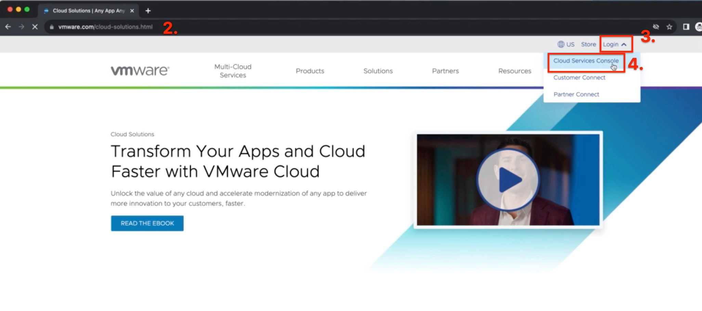
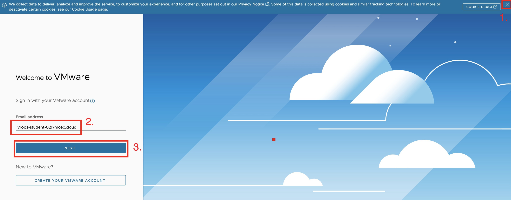
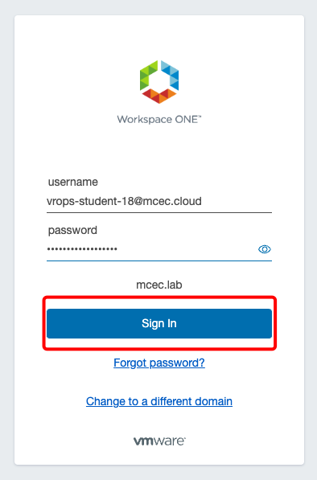
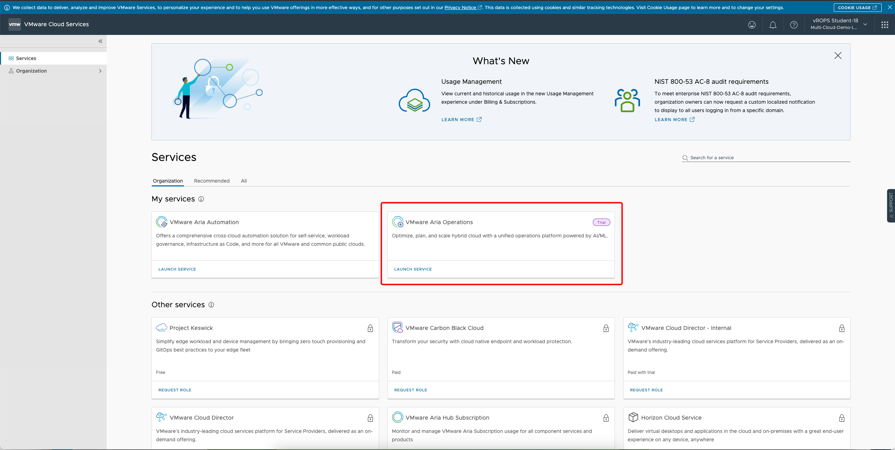
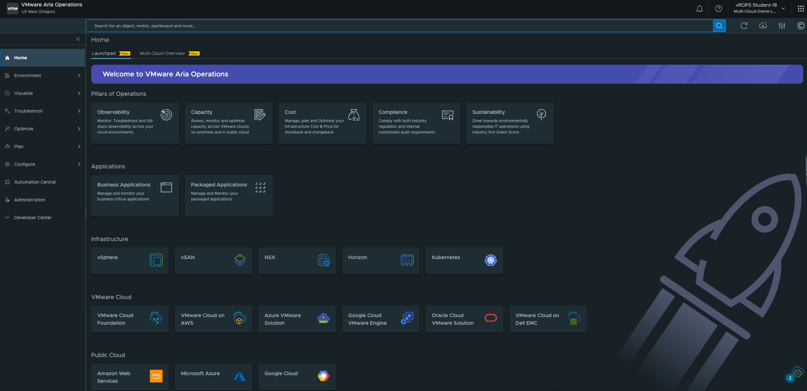

# Access to the workshop

In this part of the module we will learn how to access the Cloud Aria Operations from web browser.

## Firewall requirements

HTTPS port 443 opens to outgoing traffic with access through the firewall to:

- *.vmwareidentity.com
- gaz.csp-vidm-prod.com
- *.vmware.com
- *.vrops-cloud.com
- [s3-us-west-2.amazonaws.com/vrops-cloud-proxy](https://s3-us-west-2.amazonaws.com/vrops-cloud-proxy)

## Web access 

1. Start a web browser of your choice (Chrome or Firefox recommended).

2. Go to  **<a href="https://www.vmware.com/cloud-solutions.html" target="_blank">Cloud.VMware.com</a>**

3. Click on **Login** in right upper corner.

4. Choose **Cloud Services Console**. It will redirect you to new browser tab. 

## Login to Portal

1. Close COOKIES USAGE banner by clicking **x**.

2. Fill in login credentials provided in the lab invitation email:

   Login: drops-student-##@mcec.cloud 

3. Click on **NEXT**

\\\

You will be redirected to Workspace ONE login. Please provide your user ID and password (you received email with login credentials).

**username**: 	....................................................

**password:** 	....................................................

Click on **LAUNCH SERVICE** VMware Aria Operation.

Enjoy LAB exercises!!! 

