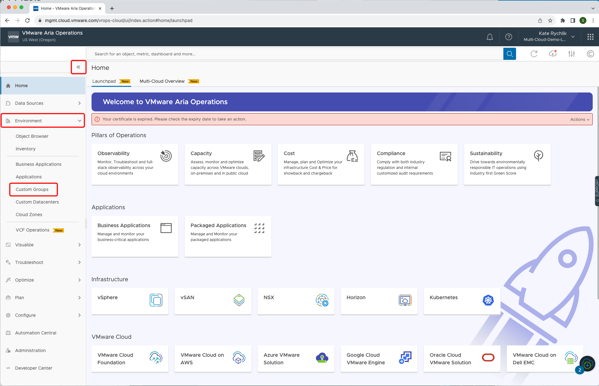
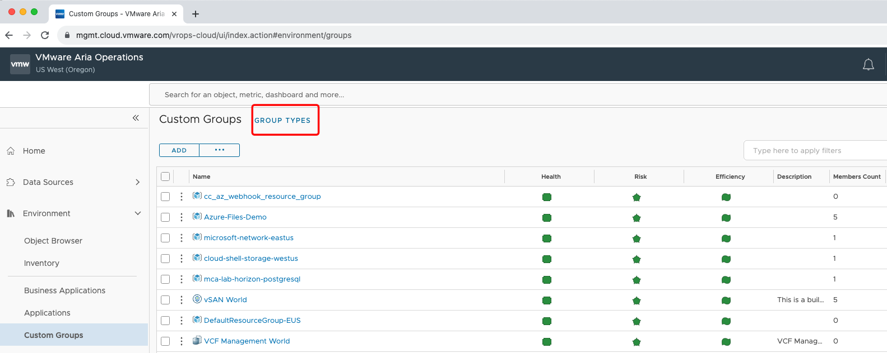
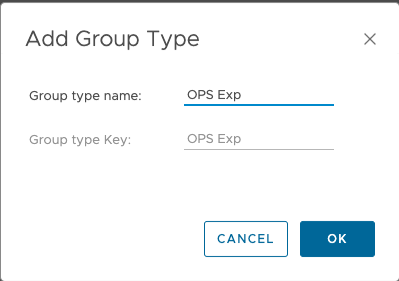
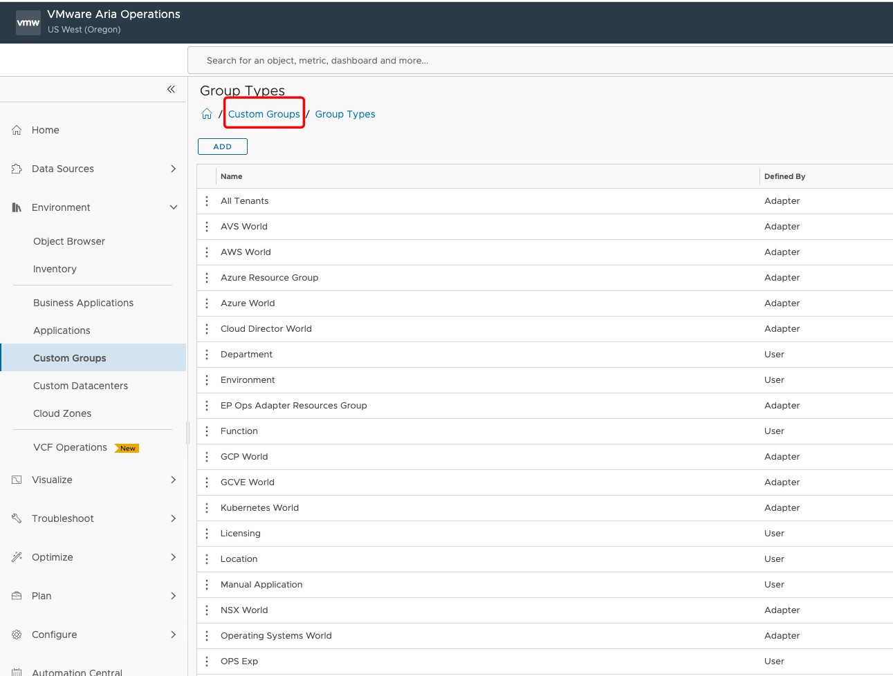
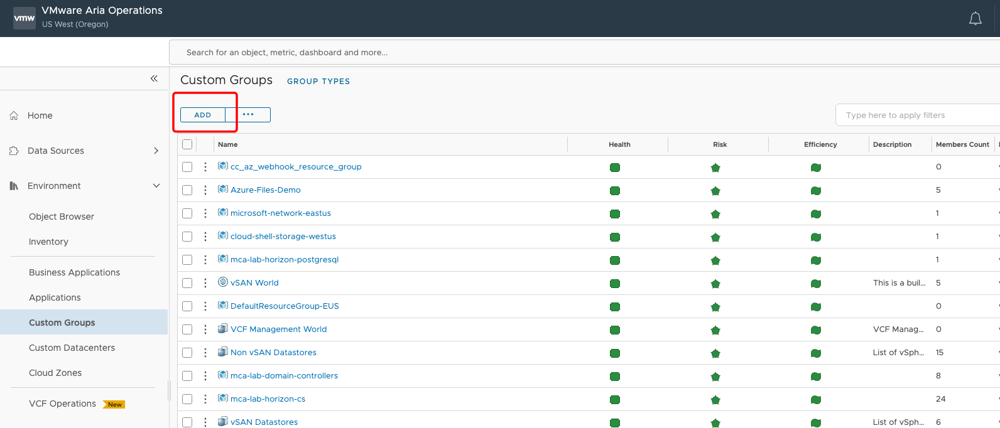
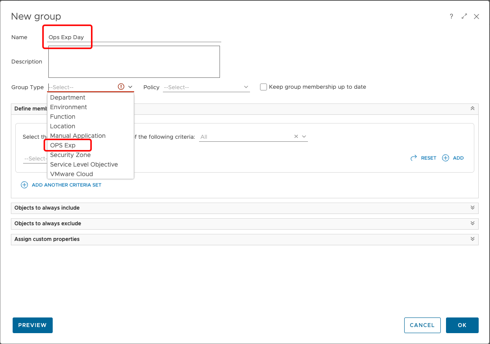
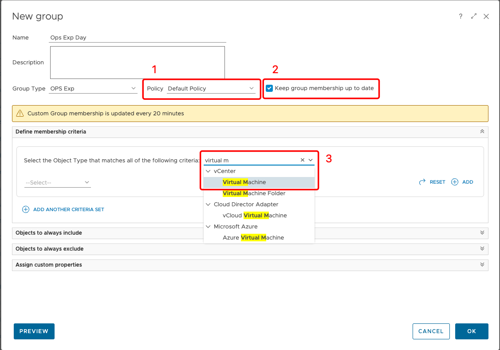
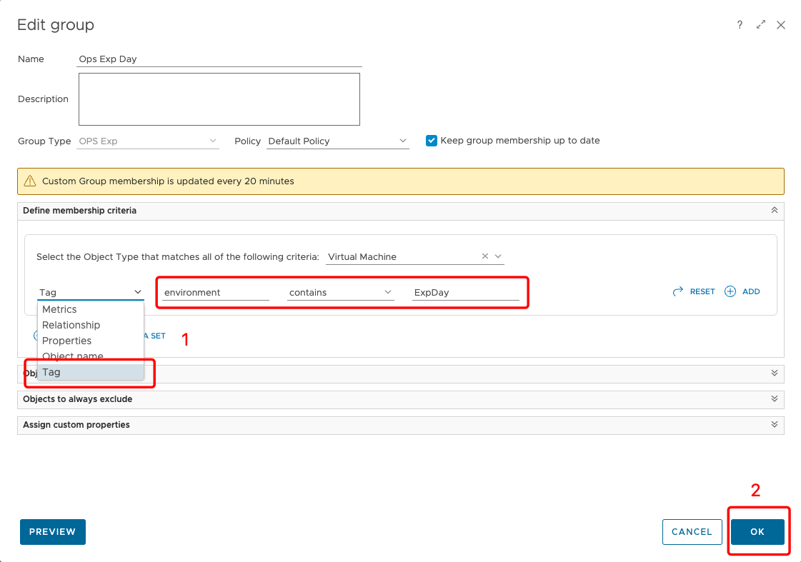
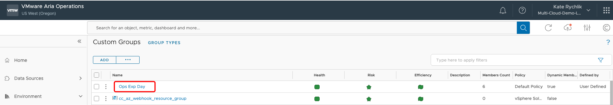
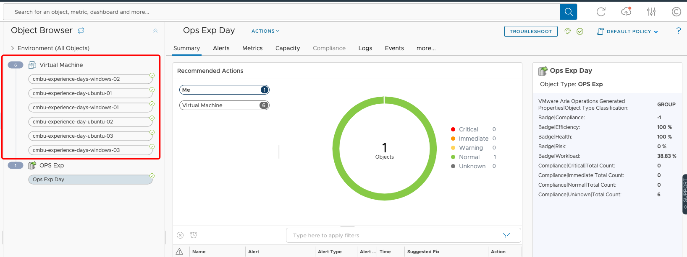

# Create a Custom Group 

## Create a group type

In this section you will learn how to create a custom group in VMware Aria Operations. You use groups to categorize your objects and have the system collect data from the groups of objects and display the results in dashboards and views according to the way you define the data to appear.

You can create static groups of objects, or dynamic groups with criteria that determine group membership as VMware Aria Operations discovers and collects data from new objects added to the environment. For the purpose of this exercise we will create a static group.  

1. Click on the left side toolbar icon representing **Environment**. 
2. Click **Custom Group**. 

To create new group type click on **GROUP TYPES**

### Why new group type is created?

Use group types to categorize your objects so that the system can apply policies to them to track, and display specific status, such as alerts, workload, faults, risk, and so on.

When you create a new group type, VMware Aria Operations adds it to the existing list of group types, and creates a new folder with the name of your group type in the Environment Custom Groups list.

When you create a new group of objects, you assign a group type to that group of objects. You add objects from the inventory trees to your custom group, then create your dashboard, add widgets to the dashboard, and configure the widgets to display the data collected from the objects in the group. You can then monitor and manage the objects.

You can apply a group type to a group of objects that you create manually, or to object groups that you cannot modify, such those added by adapters. Each adapter that you add to VMware Aria Operations adds one or more static groups of objects to group the data received from the adapter sources.

The list of group types appears in the Content area under Group Types. The custom object groups appear in the Environment area under Custom Groups.

Click on **ADD**

1. Type **Gropu type name:** "OPS Exp".
2. Click **OK**

Go back to **Custom Groups** by clicking the hyperlink. 

## Create Custom Group

We are going to add Custom Group by clicking **ADD**.

Provide **New** group name "Ops Exp Day" and assign the **Group Type "OPS Exp"** from dropdown list. 

1. Assign **Policy**: Default Policy.
2.  Check **Keep group membership up to date**. 
3. Define membership criteria by choosing **Virtual Machine** object

1.  Select Tag name the **Tag category** as "environment" select **contains** "ExpDay".

   Note: Please remember that values provided are 

2. Click **OK**.

Clik on the **Ops Exp Day** group name to see it's details. 

If everything went well, we can see Virtual Machine objects. 

