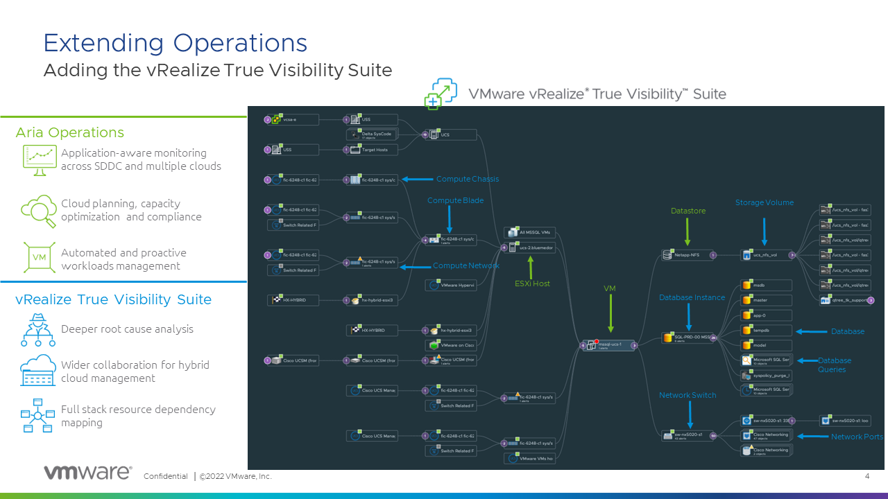

# Aria Operations for Integrations

## AKA. True Visibility Suite (TVS)

**Extended Reach:** Aria Operations for Integrations aka. True Visibility Suite (TVS) extends the monitoring capabilities of Aria Operations into hardware infrastructure (like storage, servers, and networking equipment), databases, applications, and other IT operations areas. This broadened scope can provide a more comprehensive picture of the entire IT environment.

**Unified View:** By integrating a wider range of metrics and logs into Aria Operations, Aria Operations for Integrations aka. True Visibility Suite (TVS) can offer a unified dashboard view that aids in both routine monitoring and troubleshooting efforts.

**Improved Problem Diagnosis:** With a broader data set, it can be easier to correlate issues across different layers of an infrastructure. This can lead to faster diagnosis and resolution of problems.

**Customizable Dashboards:** While the suite comes with a range of predefined dashboards, it also offers the ability to customize or create new dashboards tailored to specific needs

Bringing all of these technologies into Aria Operations. Aria Operations takes care of all the “core” SDDC elements – your vSphere, vSAN, K8s, and so-on, but we know that there are times when the health of those pieces depends on the environment that it’s running on.

The main things that we want to explore today are how end-to-end visibility of your stack can create a collaborative management environment, with relationship-aware data that multiple teams can trust can drastically reduce your troubleshooting time, and change the behavior of your team to a proactive approach to management.

Here is a quick illustration that explains the logistics of how this works. 

We have all of the physical infrastructure, apps and databases, and then we have the True Visibility Suite management pack, which is a remote connection, ***no agents required***, and that brings the information into Aria Operations. 

In this view, we outline the specific functionalities that these management packs introduce to Aria Operations. Within the **green** highlighted section, you will observe the VM, host, and datastore. These elements are what you receive with the out-of-the-box Aria Operations. Subsequently, all features depicted in **blue** represent potential additions. It is crucial to emphasize that with this tool, one is not merely monitoring these technologies concurrently. Instead, it provides a comprehensive view of the datacenter layout, substantially facilitating the correlation of issues.

The suite offers various "management packs", each tailored for a specific technology or platform. Examples include packs for databases like SQL Server or Oracle, infrastructure components from vendors like Cisco or Dell, and other applications or services. If you own Aria Operations you are entitled to **Compute** and **Storage** management packs.
