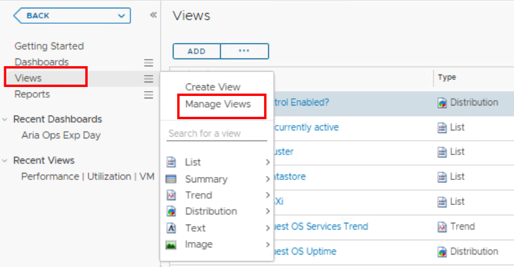
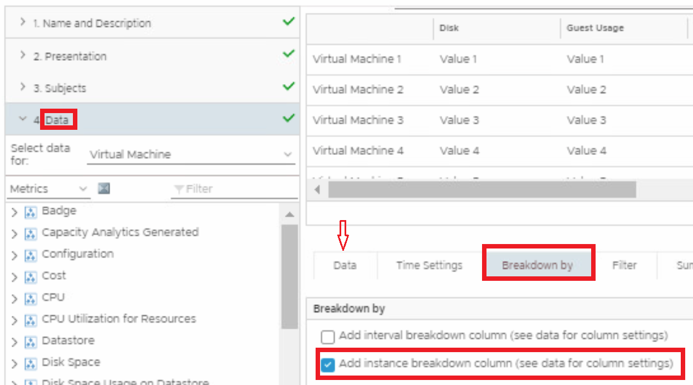
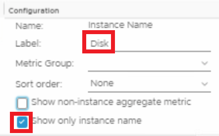

# Create a Custom View

A view presents collected information for an object in a certain way depending on the view type. Each type of view helps you to interpret metrics, properties, policies of various monitored objects including alerts, symptoms, and so on, from a different perspective. The view we will create here is used in our own custom dashboard.

   
1. Go to View -> Manage Views
2. We will create a List View, Click **Add**
3. Give it a Name: **Ops Exp DISK** or something you can recognise
4. Go to Presentation, select **List**
5. Subjects, type **Virtual Machine**
6. **Data.** Go directly to **Breakdown by**!
7. Select the: **Add Instance breakdown column (see data for column settings)**
   
8. Go back to **Data** 
9. ReName the instance to **Disk**, 
10. Select **Show only instance name** only
      
11. Let’s add some metrics on to our View, click on **Data**
12. Enter **Guest** and click **enter** in the *Filter field*
13. Double-click **Partition utilizatino (%)**
14. Double-click **Partition utilizatino (GB)**
15. Select **Properties** instead of Metrics, and re-search for **guest** in the filter field, then Add these properties:

- `Summary>Guest Operating System>Hostname`

- `Guest OS IP Address`

- `Summary>Configuration>Parent Datacenter`

- `Summary>Configuration>Parent Cluster`

- `Summary>Configuration>Parent Host`

   

   We’re done, remember to Click **SAVE**! 