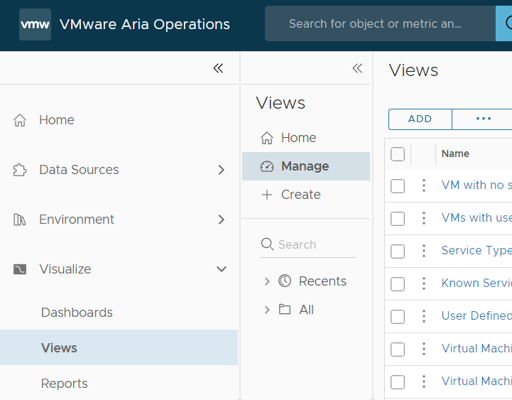
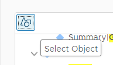
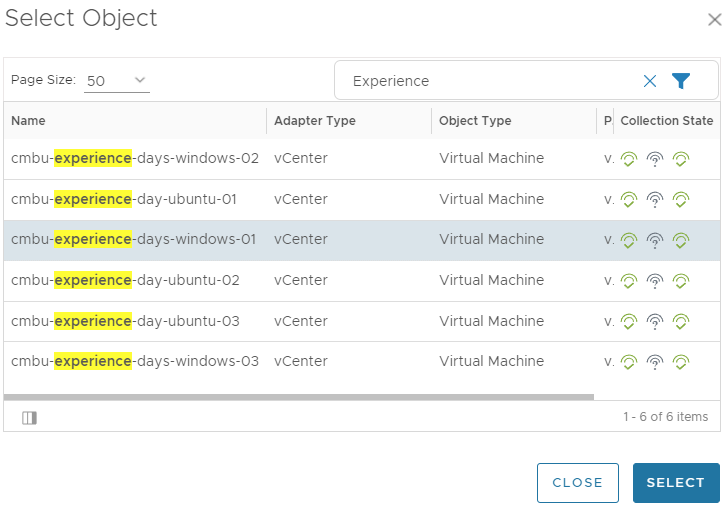
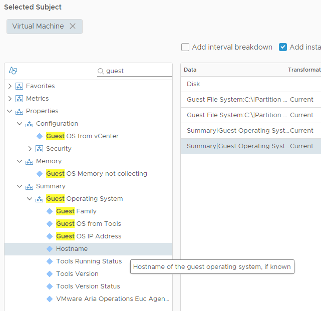
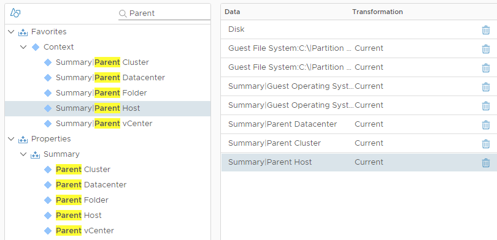
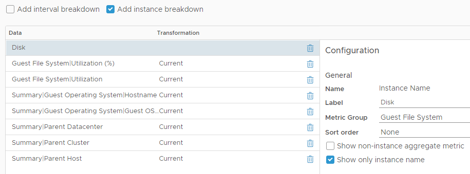

# Create a Custom View

A view displays gathered information about an object in a particular manner, based on the view type. Each view type assists you in understanding metrics, properties, and policies of different monitored objects, such as alerts, symptoms, and more, from distinct viewpoints. The view we are going to create, is going to be used in our custom dashboard.

 

1. In Aria Operations Go to **Visualize->Views ->Manage**

2. We will create a List View, Click **Add**

3. Under the View Types, select **List**

4. Give it a Name: **Ops Exp DISK** or something you can recognize for later, a description is optional, but it is recommended in the future as a documentation

5. Expand the **> Settings** section, but do not change anything

6. Click **Next**

7. Behind “Add Subject” type **Virtual** and select **Virtual Machine**
8. Let’s add some metrics on to our View, but before we do so, let us select an object Click the Select Object **ICON**:
    

9. In the Search Field, type “**Experience**” And press **enter**

10. Select the server called  **cmbu-experience-days-windows-01** and click **SELECT**
    

11. In the *search field* type **Guest** and click **enter**

12. Expand Metrics>Guest File System>C:\   and double-click on these two: 
     **Partition utilization (%)**
     **Partition utilization (GB)**

13. Close the Favorites and Metrics , and Expand  **> Properties** 

14. Add these TWO properties by **double-clicking**:

- Summary>Guest Operating System>**`Hostname`**

- **`Guest OS IP Address`**

   
   
15. In the Search Field, type “**Parent**” and press **Enter**
16. Add these properties by **double-clicking**:

   - `Properties>Summary>Parent Datacenter`

   - `Properties>Summary>Parent Cluster`

   - `Properties>Summary>Parent Host` 

   - 

17. Select  **Add Instance breakdown **  
    
 18. Behind Label, type **Disk**

 19. Behind “Metric Group” select **Guest File System**

 20. Unselect “Show non-instance aggregate metric”

 21. Select **Show only instance name** 
>
>     NOTE: Selecting the "Guest File System" **metric group** lets you keep a close eye on the file systems within your virtual machines, ensuring that they have enough space and are performing as expected. In other words, we will track and monitor the different file systems (like C: drive, D: drive, etc.) on how much space they have, usage (that's 'used'), and other relevant statistics.
>
 

22. Click **NEXT**, observe
23. Click **NEXT**, observe
24. Click **NEXT**, observe
25. Click **CREATE**

#### Now that we have created our view, we can create multiple dashboards, each with its own set of views and widgets, and tailor our monitoring experience to different use cases. As we add widgets to dashboards we can also Add **our view**

