# Create Dashboard

Dashboards present a visual overview of the performance and state of objects in your virtual infrastructure. You use dashboards to determine the nature and timeframe of existing and potential issues with your environment. You create dashboards by adding widgets to a dashboard and configuring them.

As a part of this lab we are going to build custom dashboard which will allow us to see performance data for selected application, this will simplify troubleshooting. 

The goal is to create a dashboard that will look like this: 

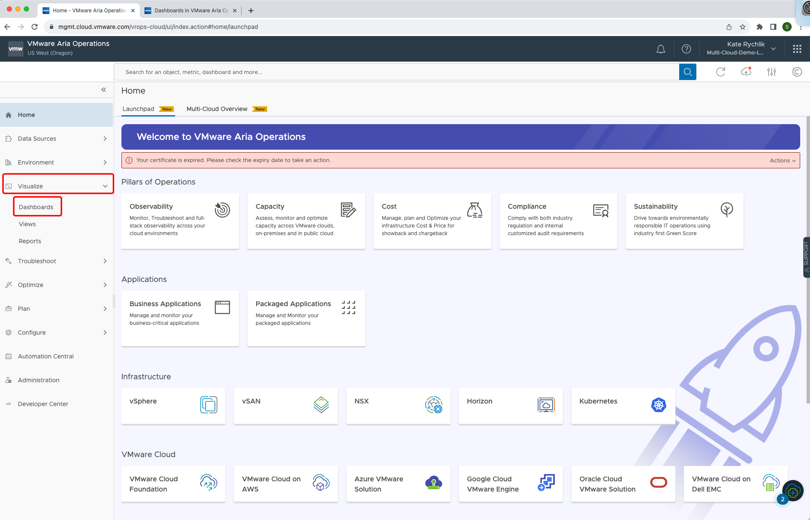

In **Visualize** section select **Dashboards**.

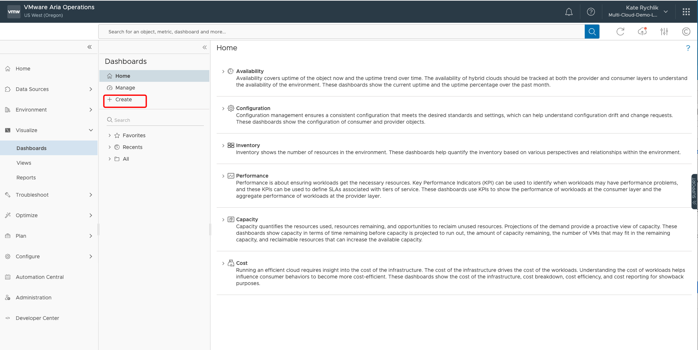

Click on **+ Create** to start building dashboard. 

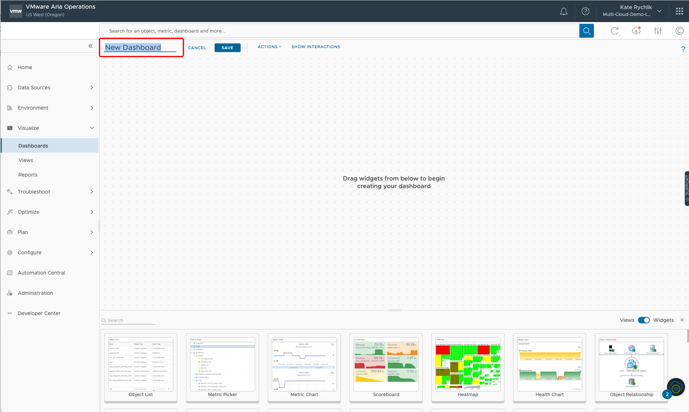

New blank dashboard canvas opens. Provide dashboard name by replacing **New Dashboard** name with your **FirstNameLastName MonMorning** . 

**Note:** <u>This is very important step to name your dashboard properly. The lab is hosted on one VMware Aria Operations instance and having multiple dashboards with the same name can cause issues!</u> 

### Create Application Selection Filter

1. Confirm that you renamed the dashboard to your "FirstNameLastName Mon Morning" as per exaple. 
2. Select **Object List** widget and drop it down to canvas. 
3. Click on **pencil icon** to edit. 

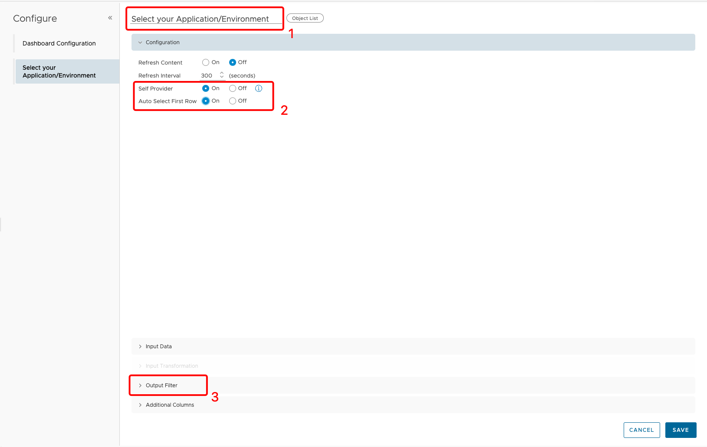

1. Provide **List Object name** "Select your Application/Environment".

2.  Change **Self Provider and Auto Select First Row** to **On**.

3. Clik on **> Output Filter**. 

   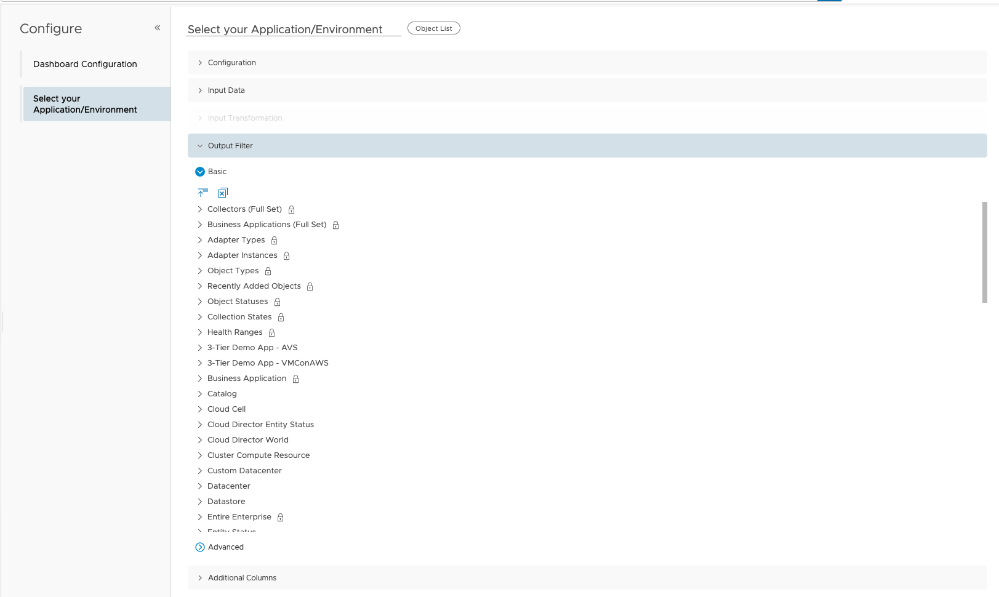

1. In **>Output Filter** scroll down the list and make multiple selections:

   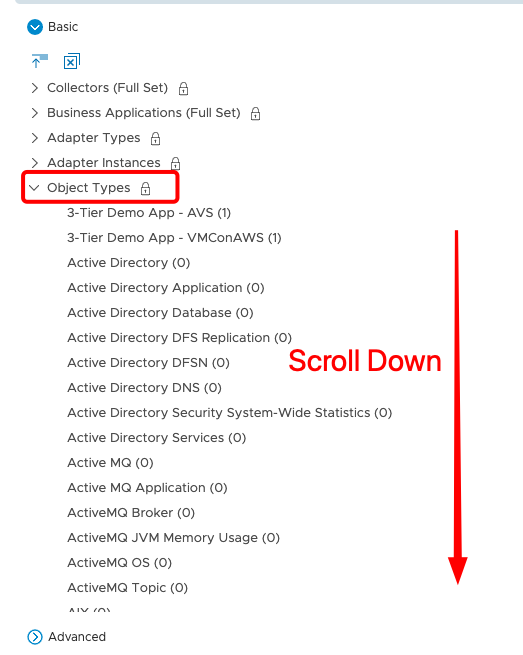

   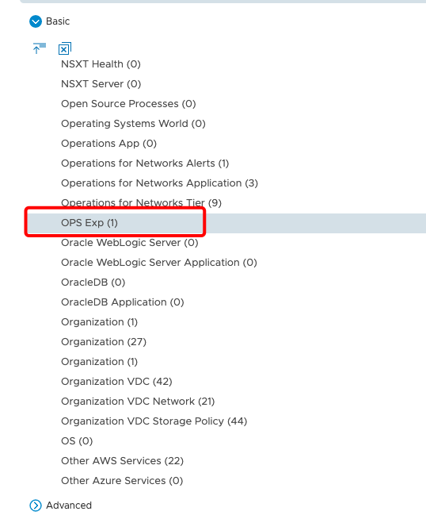

   1. Collaps **Object Types**  and scroll down to find **OPS Exp** object. Click on it to mark it down.

      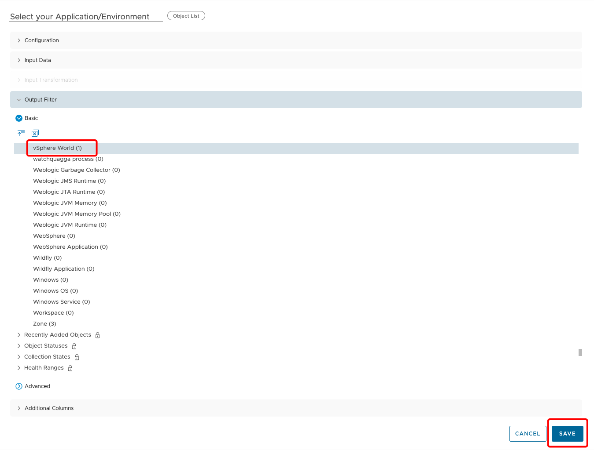

   2. Scroll down in the same group and select **vSphere World**. 

   3. Click **SAVE**.

   ### Create VMs Up or Down heatmap 

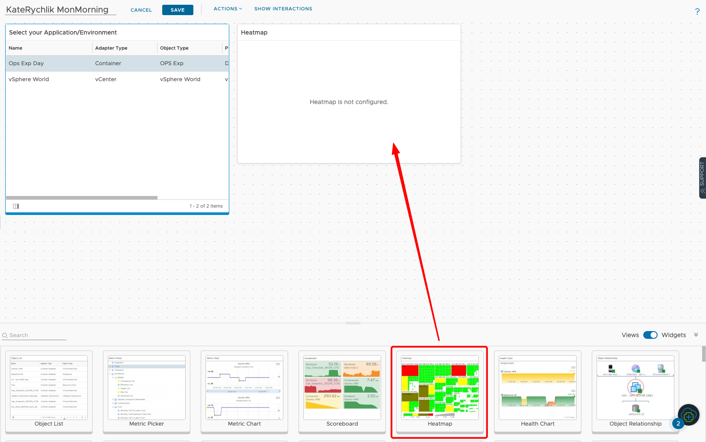

Dropdown **Heatmap** widget to canvas and click on **pencil** icon to edit.

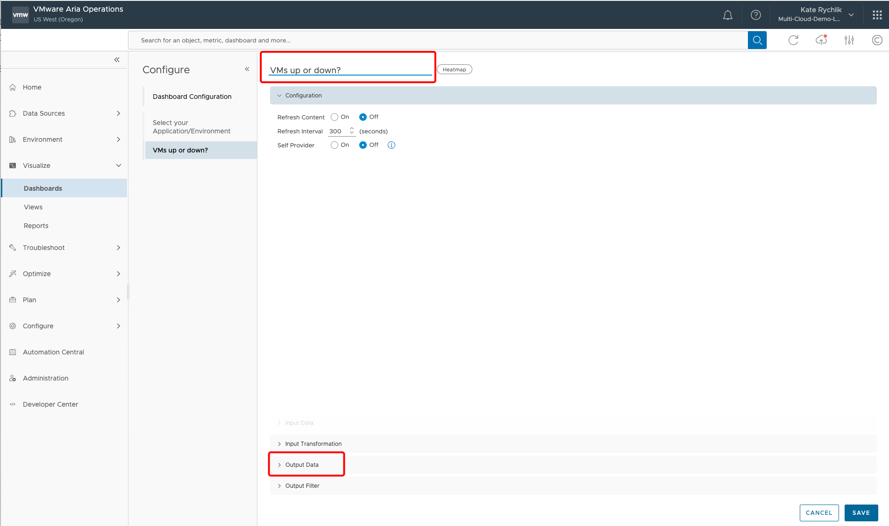

1. Rename to **"VMs up or down?"**. 
2. Click on **>Output Data**.

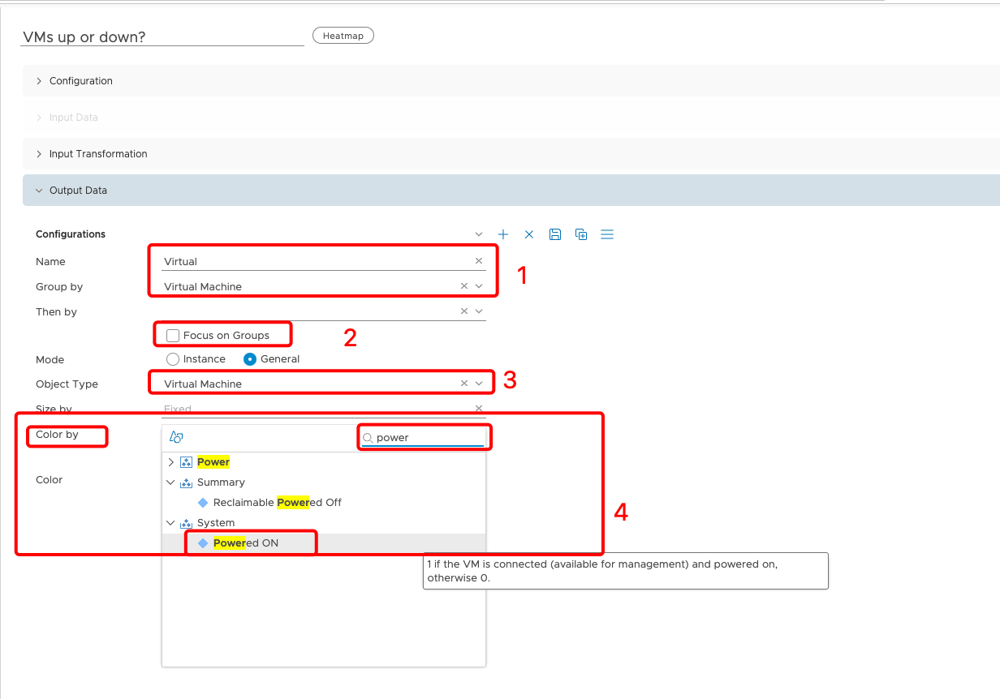

In the **Output Data** widow:

1. Type a configuration **Name**: **Virtual** and select **Group by** Virtual Machine. 
2. Uncheck **Focus on Groups**.
3. Select **Object Type** Virtual Machine. 
4. Select **Color by** in search field type **Powered ON** - click on the metric. 

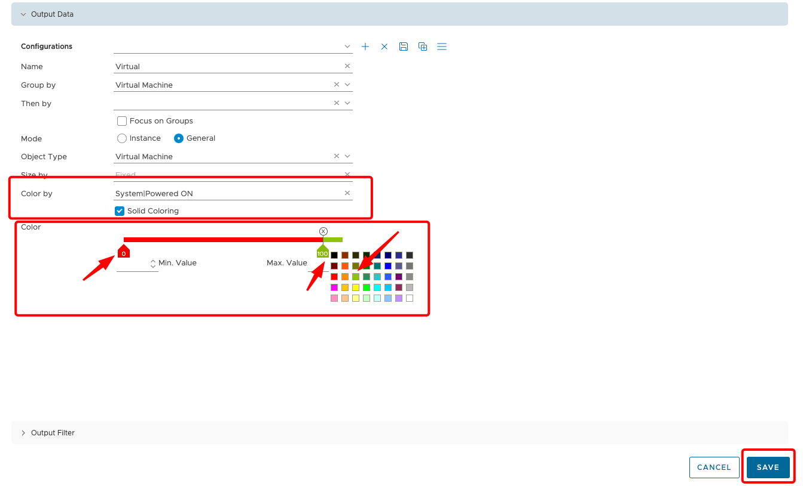

1. Check **Solid Coloring**. 
2. Choose only 2 values on the graph. Select **RED** color for **0** value and **GREEN** for **100** vaule.
3. Click **SAVE**.

### Select multiple default widgets

VMware Aria Operations offers default widgets that represent set of data, those widgets usually do not require changes. 

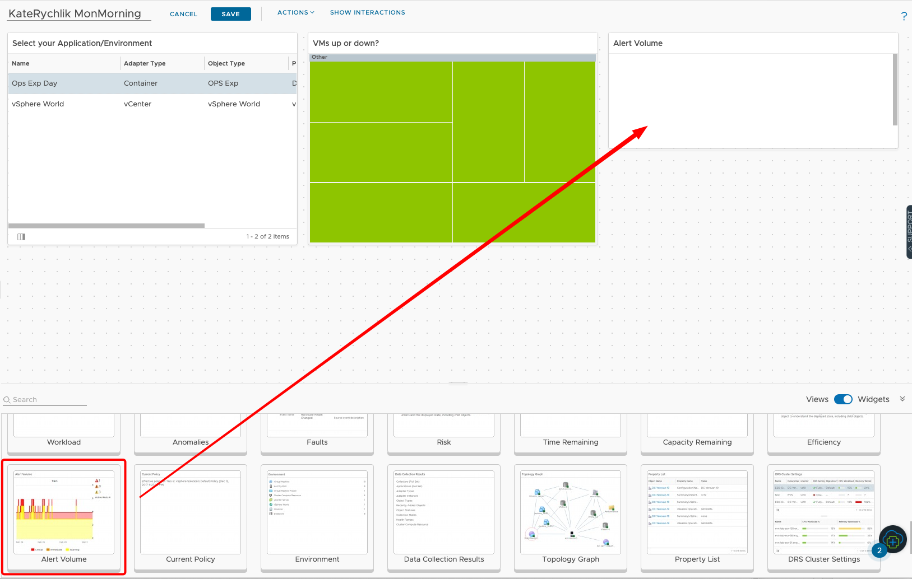

Drop **Alert Volume** widget and make it smaller than previous widget. 

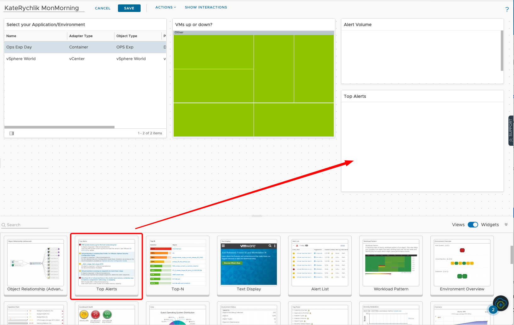

Drop **Top Alerts** widget and make it smaller. 

### View widget

The key component of a Report or a Dashboard is a View. A View helps you interpret data (such as metrics, properties, policies and symptoms) from a number of perspectives. Those perspectives can be transformed to highlight how the data has historically changed (trend) or how the data may look in the future (forecast) built on the historical trend.In this module we will walk through the creation of custom views in VMware Aria Operations. Successfully creating custom views will ensure we can use VMware Aria Operations to track what is important/critical to the monitoring of our VMware Cloud Infrastructure.

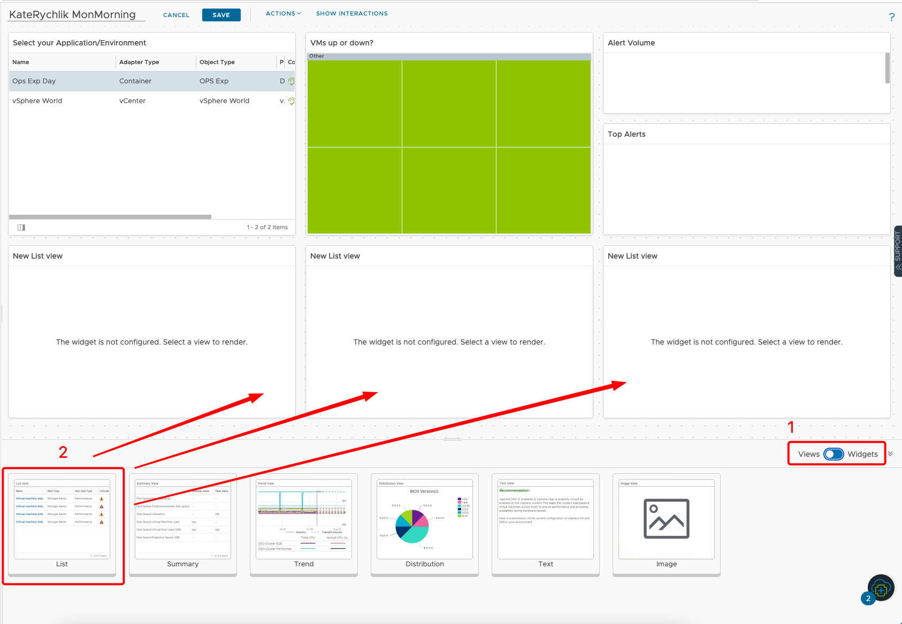

1. Switch to **Views**.
2. Drop few **List** widgets.
3. Click **Pencil** icon to edit. 

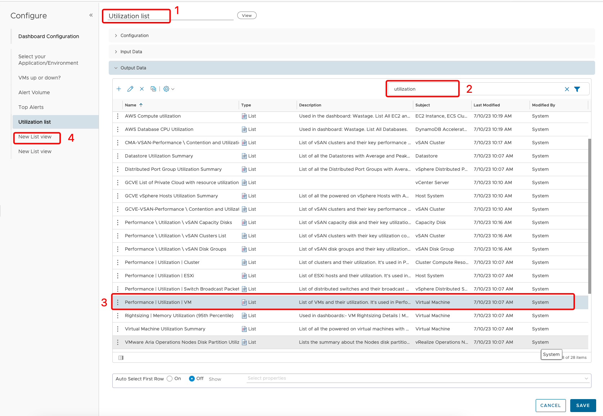

1. Change the name to "Utilisation list".
2. Type in filter field "utilization".
3. Find and select **Performance|Utilization|VM** view. 
4. Click on **New list view** on the left panel to edit next widget. 

