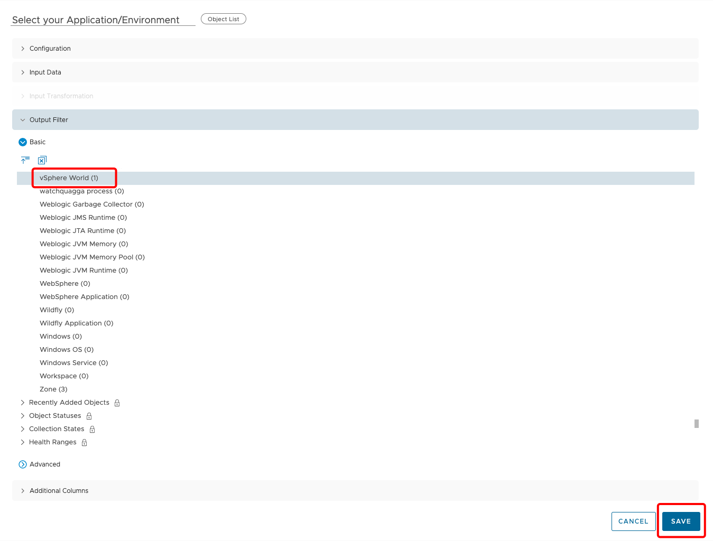
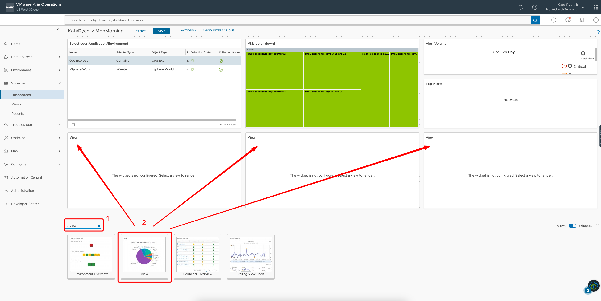
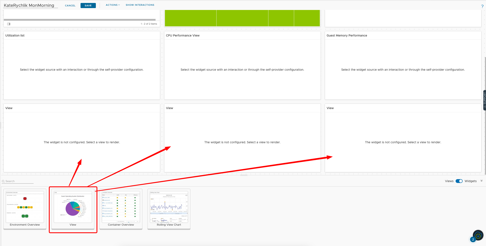
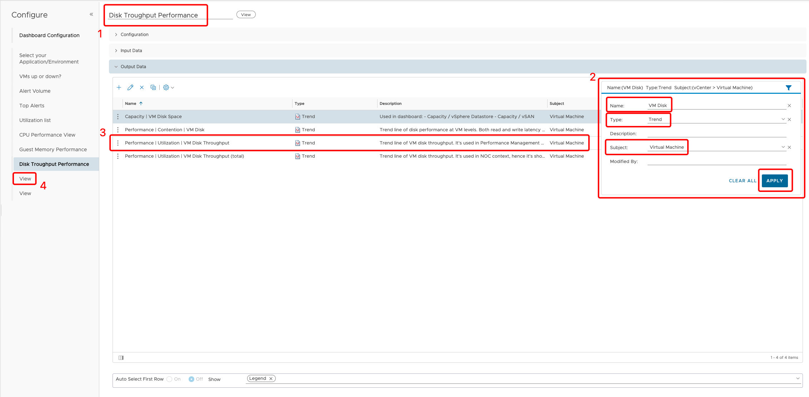
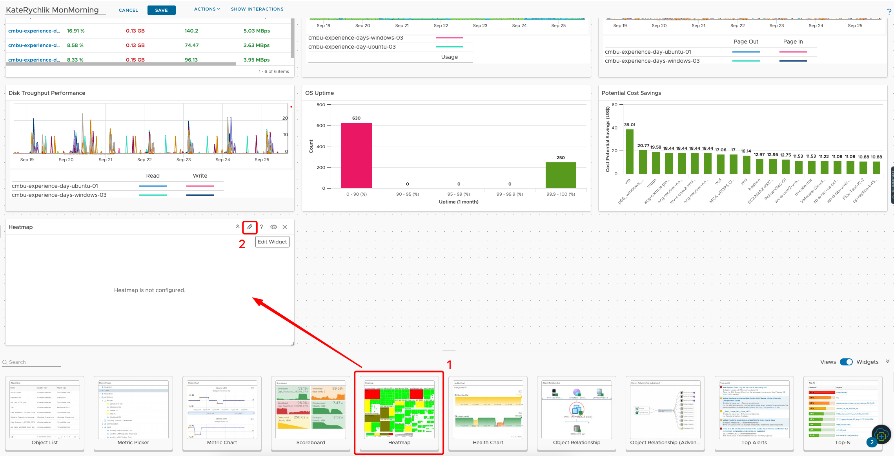
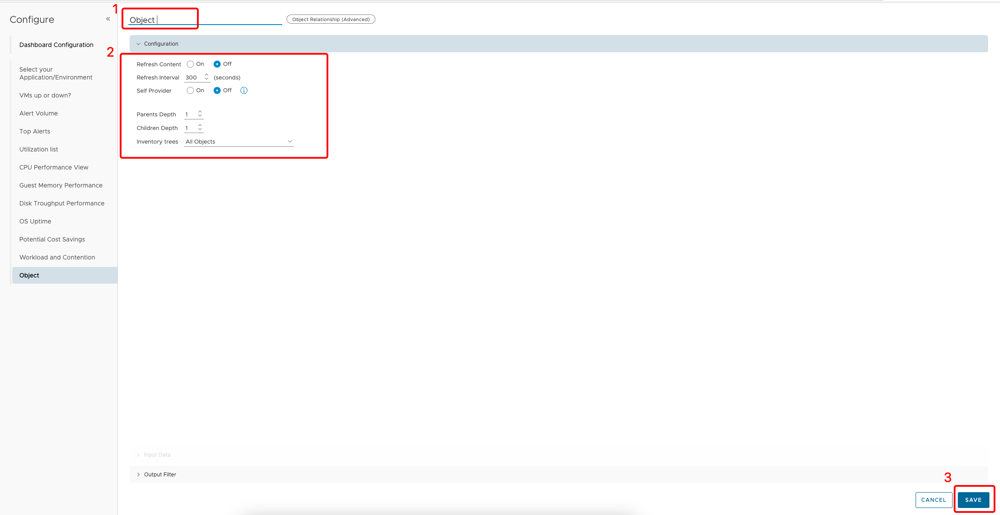
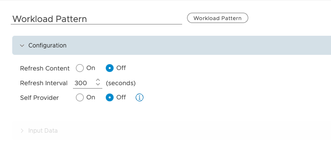
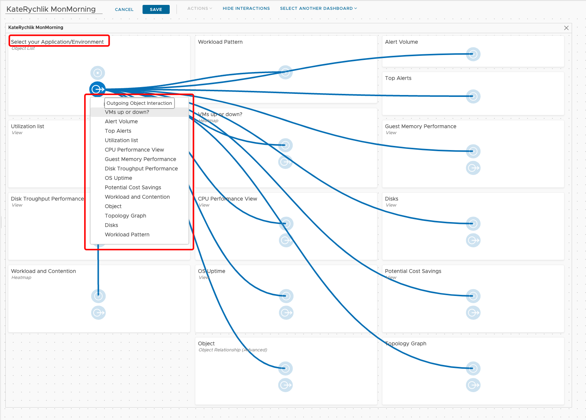

# Create Dashboard

Dashboards present a visual overview of the performance and state of objects in your virtual infrastructure. You use dashboards to determine the nature and timeframe of existing and potential issues with your environment. You create dashboards by adding widgets to a dashboard and configuring them.

As a part of this lab we are going to build custom dashboard which will allow us to see performance data for selected application, this will simplify troubleshooting. 

The goal is to create a dashboard that will look like this: 

### Lets start!  

In **Visualize** section select **Dashboards**.

Click on **+ Create** to start building dashboard. 

New blank dashboard canvas opens. Provide dashboard name by replacing **New Dashboard** name with your **FirstNameLastName MonMorning** . 

**Note:** <u>This is very important step to name your dashboard properly. The lab is hosted on one VMware Aria Operations instance and having multiple dashboards with the same name can cause issues!</u> 

### Create Application Selection Filter

1. Confirm that you renamed the dashboard to your "FirstNameLastName Mon Morning" as per exaple. 
2. Select **Object List** widget and drop it down to canvas. 
3. Click on **pencil icon** to edit. 

1. Provide **List Object name** "Select your Application/Environment".

2.  Change **Self Provider and Auto Select First Row** to **On**.

3. Clik on **> Output Filter**. 

   

1. In **>Output Filter** scroll down the list and make multiple selections:

   

   

   1. Collaps **Object Types**  and scroll down to find **OPS Exp** object. Click on it to mark it down.

      

   2. Scroll down in the same group and select **vSphere World**. 

   3. Click **SAVE**.

   ### Create VMs Up or Down heatmap 

Dropdown **Heatmap** widget to canvas and click on **pencil** icon to edit.

1. Rename to **"VMs up or down?"**. 
2. Click on **>Output Data**.

In the **Output Data** widow:

1. Type a configuration **Name**: **Virtual** and select **Group by** Virtual Machine. 
2. Uncheck **Focus on Groups**.
3. Select **Object Type** Virtual Machine. 
4. Select **Color by** in search field type **Powered ON** - click on the metric. 

1. Check **Solid Coloring**. 
2. Choose only 2 values on the graph. Select **RED** color for **0** value and **GREEN** for **100** vaule.
3. Click **SAVE**.

### Select multiple default widgets

VMware Aria Operations offers default widgets that represent set of data, those widgets usually do not require changes. 

Drop **Alert Volume** widget and make it smaller than previous widget. 

Drop **Top Alerts** widget and make it smaller. 

### View widget

The key component of a Report or a Dashboard is a View. A View helps you interpret data (such as metrics, properties, policies and symptoms) from a number of perspectives. Those perspectives can be transformed to highlight how the data has historically changed (trend) or how the data may look in the future (forecast) built on the historical trend.In this module we will walk through the creation of custom views in VMware Aria Operations. Successfully creating custom views will ensure we can use VMware Aria Operations to track what is important/critical to the monitoring of our VMware Cloud Infrastructure.

1. Type **view** in search field
2. Drop few **View** widgets.
3. Click **Pencil** icon to edit. 

### Utlization list

1. Change the name to "Utilization list".
2. Select **funnel** icon to use filter option:

   - Name: **Performance**
   - Type: **List**
   - Subject: **Virtual Machine**

   Click on **APPLY**.
3. Find and select **Performance|Utilization|VM** view. 

**NOTE:** Make sure that after selecting the row will change color. 

4. Click on **View** on the left panel to edit next widget. 

### CPU Performance View

1. Change the name to "CPU Performance View".

2. Select **funnel** icon to use filter option:

   - Name: **VM CPU**
   - Type: **Trend**
   - Subject: **Virtual Machine**

   Click on **APPLY**.

3. Find and select **Performance|Utilization|VM CPU** view. 

4. Click on **View** on the left panel to edit next widget. 

### Guest Memory Performance

1. Change the name to "Guest Memory Performance".

2. Select **funnel** icon to use filter option:

   - Name: **Guest OS Memory**
   - Type: **Trend**
   - Subject: **Virtual Machine**

   Click on **APPLY**.

3. Find and select **Performance|Guest OS Memory** view. 

4. Click on **SAVE**.

Drop another 3 **View** widgets. 

Click on **Pencil** icon to Edit Widget. 

1. Change the name to "Disk Troughput Performance".

2. Select **funnel** icon to use filter option:

   - Name: **VM Disk**
   - Type: **Trend**
   - Subject: **Virtual Machine**

   Click on **APPLY**.

3. Find and select **Performance|Utilization|VM Disk Troughput** view. 

4. Click on **View** on the left panel to edit next widget. 

### Custom View widget

If the listed views do not provide required data, we can change existing view and amend it to desired state. We will practice this now. 

1. Drop a **View** widget.
2. Click on **Pencil** icon to edit. 

### Disk view

Type a view **Name** FirstnameLastname ExpDay Disk and click **NEXT**.

1. Rename the view to **Disk view**.

2. Select **funnel** icon to use filter option:

   - Name: **guest**
   - Type: **List**

   Click on **APPLY**.

3. Select **Capacity|Guest OS Partition**.

4. Click on **...** (dots) icon.

Select **Clone**.

1. Change the **Name** to **FirstnameLastname OpsExp Disk**.
2. Click on **NEXT**.

Rename the **Partition** Label to **Disk**.

Now we will be adding additional values to the view. 

1. On the left menu use search field and type "hostName" to find **Summary|Guest Operating System|Hostname** metric.
2. Drag-and-drop it to middle column.
3. Change **Metric label** to Guest Name.

1. On the left menu use search field and type "IP" to find **Summary|Guest Operating System|Guest OS IP Address** metric.
2. Drag-and-drop it to middle column.
3. Change **Metric label** to IP.

1. On the left menu use search field and type "Datastore" to find **Virtual Disk:scsi0:0|Datastore** metric.
2. Drag-and-drop it to middle column.
3. Change **Metric label** to Datastore.

1. On the left menu use search field and type "host" to find **Summary|Parent Host** metric.
2. Drag-and-drop it to middle column.
3. Change **Metric label** to Host.

1. On the left menu use search field and type "cluster" to find **Summary|Parent Cluster** metric.
2. Drag-and-drop it to middle column.
3. Change **Metric label** to Cluster.

1. On the left menu use search field and type "datacenter" to find **Summary|Parent Datacenter** metric.
2. Drag-and-drop it to middle column.
3. Change **Metric label** to Datacenter.
4. Click on **CREATE**.

1. Clear filer and type your **FirstName**.
2. Select the newly created view.
3. Click on **SAVE**.

### OS Uptime

1. Change the name to "OS Uptime".

2. Select **funnel** icon to use filter option:

   - Name: **OS Uptime**
   - Type: **Distribution**
   - Subject: **Virtual Machine**

   Click on **APPLY**.

3. Find and select **Availability|Guest OS Uptime** view. 

4. Click on **View** on the left panel to edit next widget. 

### Potential Cost Saving

1. Change the name to "Potential Cost Savings".

2. Select **funnel** icon to use filter option:

   - Name: **VM Potential**
   - Type: **Distribution**
   - Subject: **Virtual Machine**

   Click on **APPLY**.

3. Find and select **Cost|VM Potential Savings** view. 

4. Click on **SAVE**.

### Workload and Contention

1. Dropdown **Heatmap** widget to canvas.
2. Click on **pencil** icon to edit.

1. Rename to **"VMs up or down?"**. 
2. Click on **>Output Data** and provide values:
   - **Name**: Load/Contention
   - **Group by** Virtual Machine. 
   - Check **Focus on Groups**.
   - **Object Type** Virtual Machine. 
   - **Size by** in search field type: **CPU|Workload(%)**
   - **Color by** in search field type: **CPU|Contention(%)**

3. Click **SAVE**.

### Object Relationship

1. Find **Object Relationship (Advanced)** widget by typing in widget search field "relationship".
2. Drop **Object Relationship (Advanced)** widget on canvas.
3. Click on **Pencil** icon to edit.

1. Rename to **Object**.
2. Leave the default values.
3. Click **SAVE**.

### Topology Graph

1. Find **Topology Graph** widget. 
2. Drop **Topology Graph** widget on canvas.
3. Click **Pencil** icon to edit widget. 

Leave the default values and click on **SAVE**.

### Workload Pattern

1. Find **Workload Pattern** widget. 
2. Drop **Workload Pattern** widget on canvas.
3. Click **Pencil** icon to edit widget. 

Leave default values and click on **SAVE**.

### Interactions

Widget interactions are the configured relationships between widgets in a dashboard where one widget provides information to a receiving widget. When you are using a widget in the dashboard, you select data on one widget to limit the data that appears in another widget, allowing you to focus on a smaller subset data.

**How interactions work**

If you configured interactions between widget at the dashboard level, you can then select one or more objects in the providing widget to filter the data that appears in the receiving widget, allowing you to focus on data related to an object.

To use the interaction option between the widgets in a dashboard, you configure interactions at the dashboard level. If you do not configure any interactions, the data that appears in the widgets is based on how the widget is configured.

When you configure widget interaction, you specify the providing widget for the receiving widget. For some widgets, you can define two providing widgets, each of which can be used to filter data in the receiving widget.

As a part of our lab, we need to configure interactions to see data filtered by previously created group. 

Click on **SHOW INTERACTIONS** on top dashboard menu. 

Before you start the interactions show all added widgets and have no connections. 

To create interaction click on **Outgoing Object Interaction** dot for "Select your Application/Environment" widget and drag it to  **Incoming Object Interaction** on All Widgets as per screenshot. 

Repeat the step above and create interactions for all widgets in the screen. Make sure that all of them have connection created.

1. To create interaction click on **Outgoing Object Interaction** dot for "Utilization listt" widget and drag it to  **Incoming Object Interaction** on listed Widgets as per screenshot. 
2. Click on **SAVE**.

### Dashboard cleanup

To make the dashoard to display data as per desired view you need to edit and resize the widgets to form planned outcome. 

Click on **Edit Dashboard** and next play around to try to create view below. 

As a last task play around w

