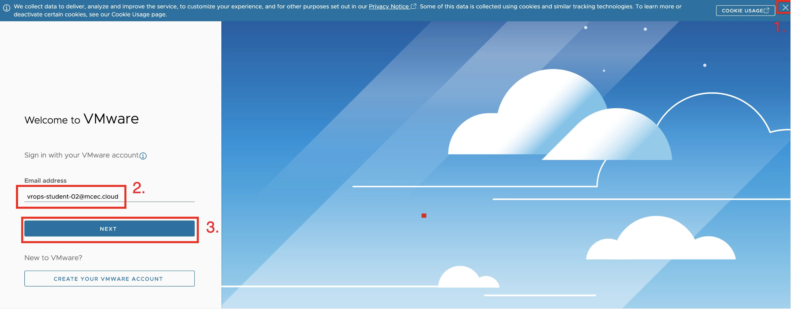

# Access to the workshop

In this part of the module we will learn how to access the Cloud Aria Operations from web browser.

## Web access 

1. Start a web browser of your choice (Chrom or Firefox recommended).

2. Go to **<a href="https://www.vmware.com/cloud-solutions.html" target="_blank">cloud.vmware.com</a>** 

3. Click on **Login** in right upper corner.

4. Choose **Cloud Services Console**. It will redirect you to new browser tab. 

## Login to Portal

1. Close COOKIES USAGE banner by clicking **x**.

2. Fill in login credentials provided in the lab invitation email:

   Login: drops-student-##@mcec.cloud 

3. Click on **NEXT**

