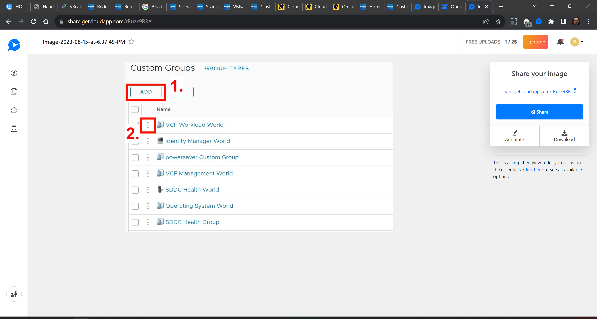
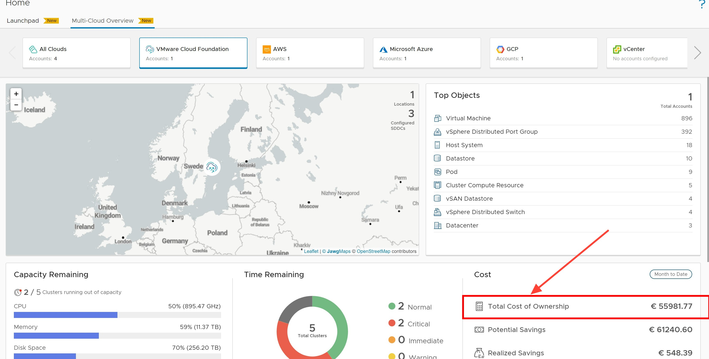

## Heading no#2



> Lorem ipsum dolor sit amet, consectetur adipiscing elit. Aenean congue mi quam, sed porta lectus viverra efficitur. Etiam convallis, felis id vehicula fringilla, ante leo gravida dui, et imperdiet lorem arcu at augue. Nullam sed massa et est aliquet eleifend. Proin venenatis dictum condimentum. Maecenas aliquet rhoncus massa, eu commodo purus mattis ac. Suspendisse non libero ultricies nulla ultrices accumsan. Ut pellentesque tristique metus id dapibus. Nullam turpis justo, condimentum id lectus eget, condimentum ultricies elit. Sed non urna sit amet ligula suscipit tempor. Suspendisse ac elit dapibus, cursus est sit amet, aliquet lacus. Curabitur a arcu tempus, egestas turpis in, vulputate velit. Suspendisse at dignissim tortor.

1. Click some **shit**
2. Click some **more shit**

Maybe add some Code:
```python
from github import Github
def main():
    # Authenticate using a token
    # NOTE: Replace 'YOUR_TOKEN_HERE' with your GitHub personal access token
    g = Github("YOUR_TOKEN_HERE")
    
# Get a specific repo (in this case, the PyGithub repo)
repo = g.get_repo("PyGithub/PyGithub")

# List open issues
print("Open issues in PyGithub repository:")
for issue in repo.get_issues(state='open'):
    print(issue.number, issue.title)


if __name__ == "__main__":
    main()
```

## Another Heading2



1. Please click  **something**
2. Open the ellipsis behind **something else**
3. even more **to do**

## Word of thought

This concludes this part of the session. Get a coffee, nut up or shut up..


