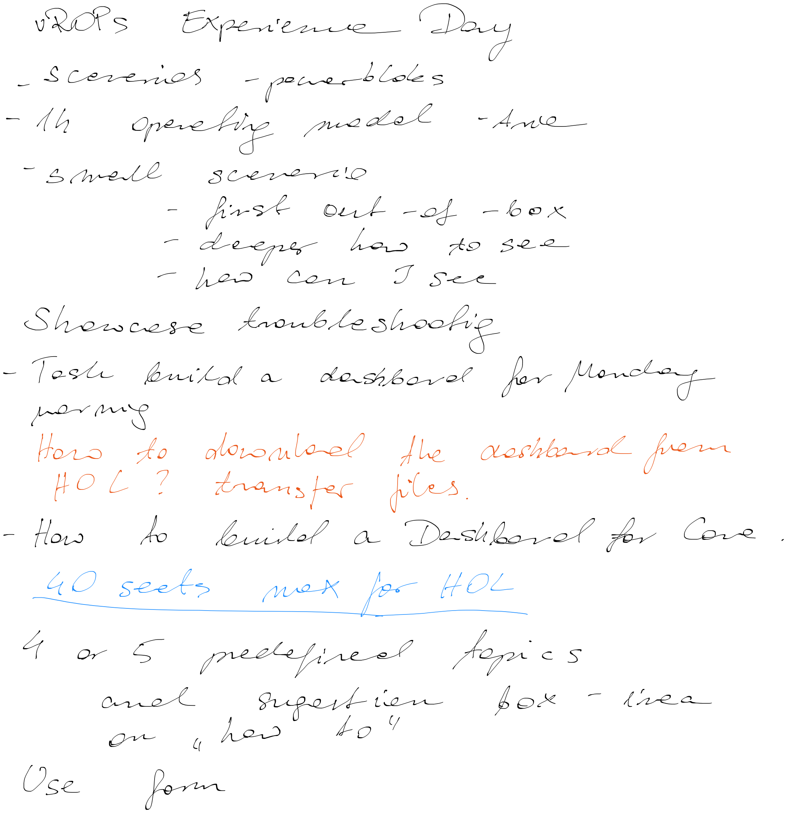
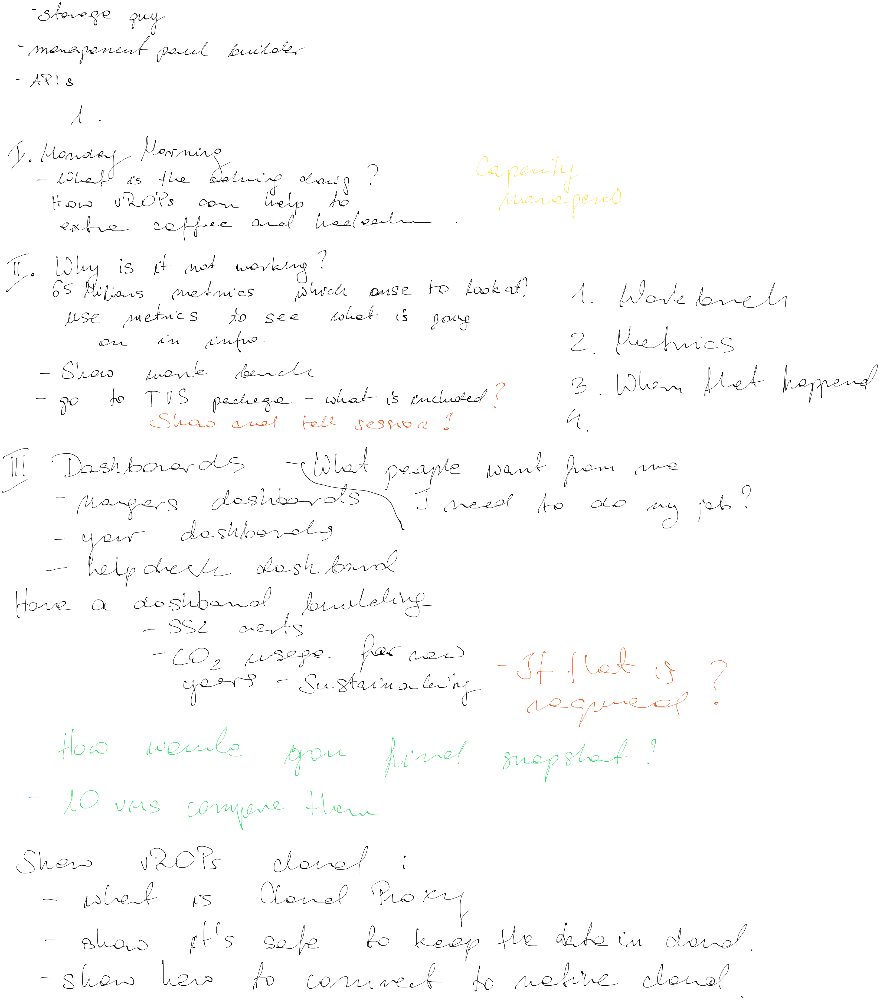

# Aria Operations 'Experience Day' - Agenda

#### 08:30 Introduction to Aria Operations
Walkthrough and introduction to what's possible with this self driving operations tool.  

#### 09:30 Recommendations, Reclaim and Right Size 
You can follow this by using your own pod / **Hands-On Labs**. We will show what you can do before using or creating dashboards

> - *Recommendations*, look into the crystal ball to predictive understand **what's going to happen** 
> - *Reclaim, Snapshots and orphaned disks* - how to find them and s**top wasting resources**
> - *Rightsizing*, the internal political discussion and how to postpone your corporate hardware investments
> - *Capacity Planning*, know **when** your company needs to invest in new hardware  

#### 10:15 Coffee break

#### 10:30 Deep dive troubleshooting 
A user called, "Why is my server not working?  A walk through scenario with Windows or Linux VMs "`problems`". Let's see if we can pinpoint what's bothering them by using the built in troubleshooting workbench to show and prove the forensics, and to deep dive in to the single metrics to compare and do a little *coincidence detection* :
>  - CPU problems. Get the full overview of usage, Co-Stop, CPU Ready, and contention. 
>  - Memory contention, do we need to add memory?
>  - Disk IO, latency, is this what's slowing down your application?

#### 12:00 LUNCH BREAK 

#### 13:00 What's expected of me? LAB Exercises! 
We will use our Lab to Create and Modify Views, Dashboards and Reports. These topics will be covered:
> - *VIEWS*: We'll look into the nifty views, and later understand the power of putting views onto dashboards.  
> - *DASHBOARDS*: We will build a dashboard for your Monday morning investigation to spend less time on operations. Let the Manager, Developer, or application owners do their own operations by sharing our dashboards. 
> - *REPORTS*: Create reports, the static blood samples of operations

#### 14:00 Environmental friendly operations
CO2 usage dashboard for next year – are you carbon efficient?

 #### 14:30 The great Wrap up 
- Something that no one did before
- super interesting topic
- think about it!
#### 15:00 Documentation, links, and resources
Let's show you a couple of Nifty resources, documentation, and our links repository
#### 15:10 Drive safe!
bye!

---
  

---

---
## Cloud Management: VMware Aria Family Brand
| Old name                  | New name                    |
| ------------------------- | --------------------------- |
| vRealize  Cloud Universal | VMware Aria Universal Suite |
| vCloud Suite              | VMware vCloud Suite         |
| vRealize  Operations      | VMware Aria Operations      |
|                           |                             |
