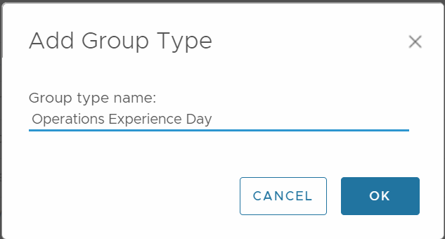
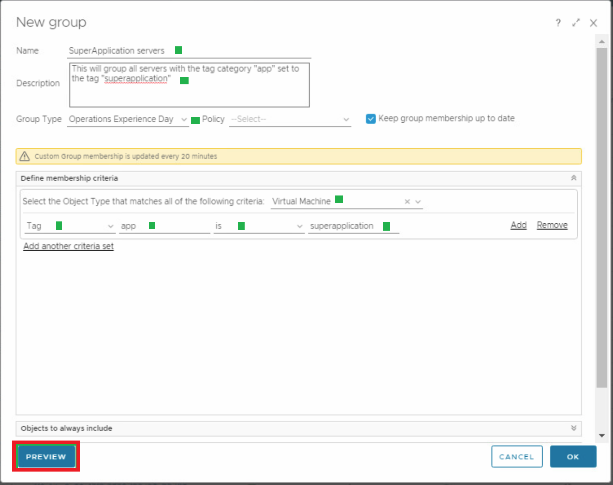
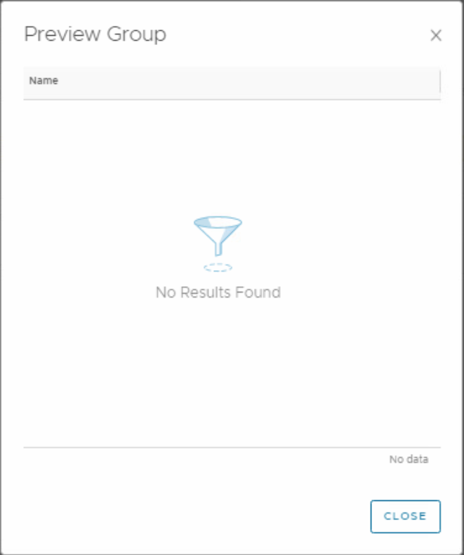
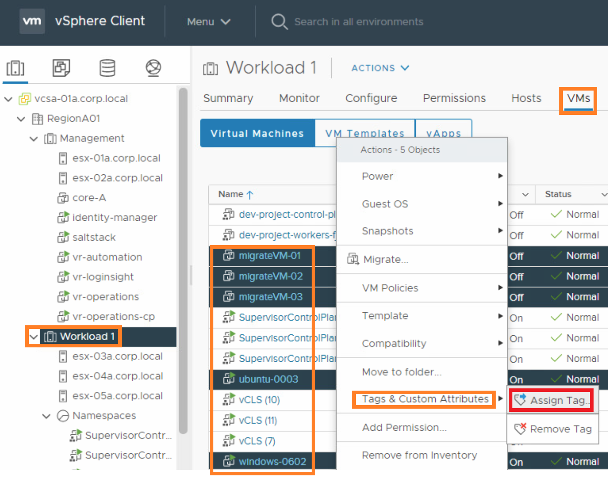
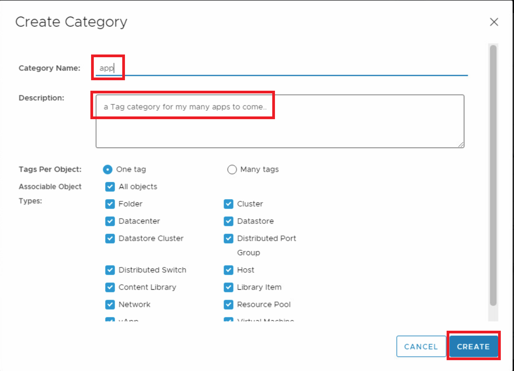
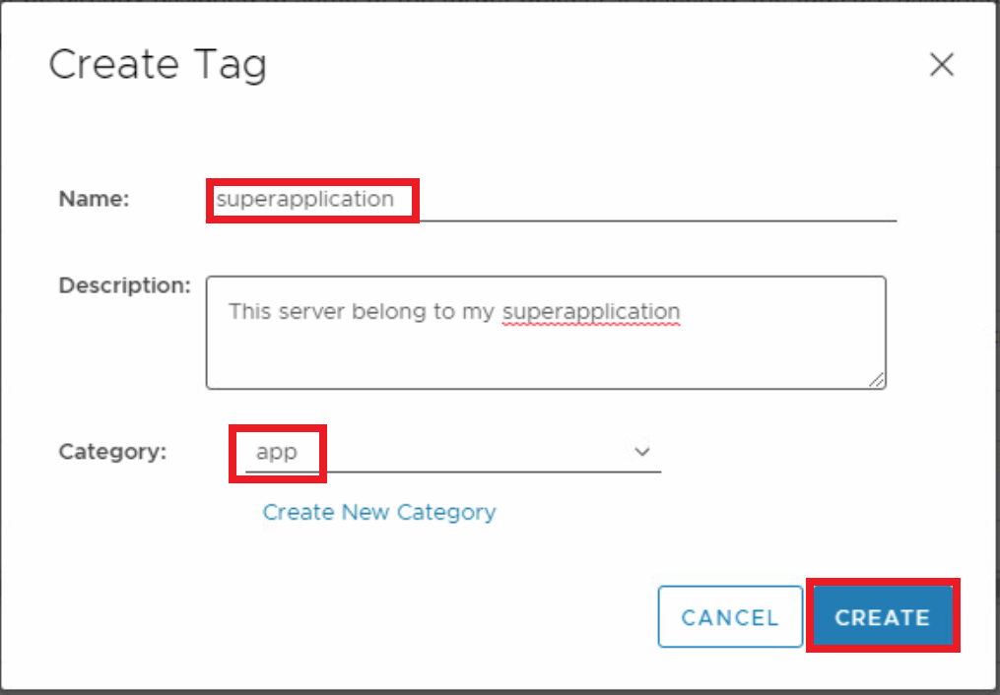
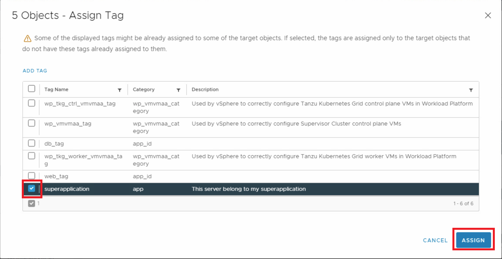
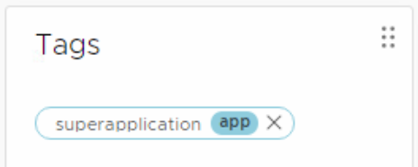
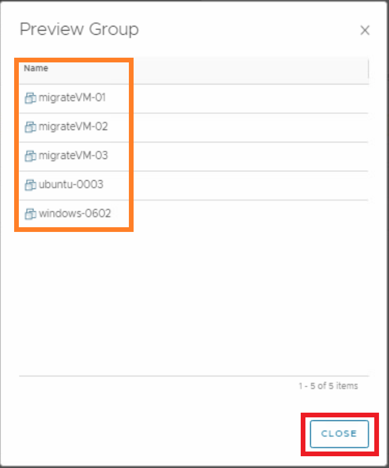

# Custom group creation

## New Group Type ##

First, we will create our own Group Type so we can build our custom groups under one umbrella. 

1) In older version 8.4: **Administration>Configuration>Group Types**
   In newer versions v8.10.2: **Left Menu>Environment>Custom Groups>Group Types** on top

2) Click **Add**, put in the name of your group, for example “<yourCompany>” and click **OK**

   

   

## New Custom Group ##

Now, Let us create our own Group to add VMs with a certain tag to the group automatically

1. In older version 8.4: Top Menu>Environment>Custom Groups
   In newer versions v8.10.2: Use Left Menu>Environment>Custom Groups 
2. Click **Add**, fill in your values:

- Name:  “<my App> Servers”
- Description: Something meaningful for this grouping of servers
- Group Type: What you Chose in step 1, ie. **<youCompany>**
- **Select** “Keep group membership up to date“
- Object Type: Virtual Machine

## Test the group

1. Click **Preview**, to preview your group and see if the memberships are OK. 
2. If there are no VMs with this exact tag, with tag category *app* and value *superapplication*, there’s nothing to show. 

Let’s go to vSphere and set some tags to see if this works. 

## Assign tags using vSphere ##

1. press **Ctrl+T** to open a new browser Tab

2. In the new tab, just **launch** your vCenter/vSphere client

3. In you cluster, find some VMs to **Select**. In other words, which VMs will belong to the *superapplication*? 

4. Rightclick, the under Tags & Custom Properties select **Assign Tag** 

   

5. Click OK, Then **Add Tag**

6. Click **Create New Category**

7. Fill in the category name **app**, add your description and click **Create**
   

8. Under Name type **superapplication**

9. add your description

10. under Category, choose **app**

11. Click **Create**
    

12. Select our tag name superapplication and click **ASSIGN**
    

13. If you check one of your VMs in the Summary, the Tag and the tag category should now be present
    

## Check the Operations Custom Group Again ## 

1. Click the **Preview** button. See the first steps in this article to see the correct values
   
2. Click **Close**
3. Click **OK** to save the group

## Conclusion

The custom group we created will be used as a foundation for selection lists when creating dashboards and views.  

**Note:** We did not associate a specific policy with the object group, and left the policy selection blank. This means this object group were not associated with any policy.  But if we did assign a policy, Aria Operations would collect data from the objects in the group based on the settings in the policy that were associated with our Custom group. The results would appear in the dashboards and views.