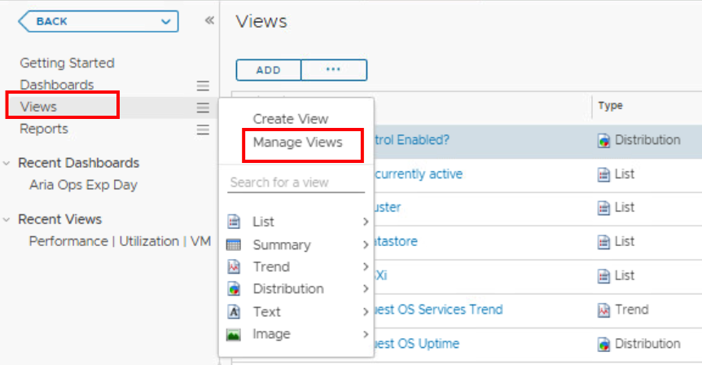

### Pre Requisites

Login to VMware HOL https://labs.hol.vmware.com/HOL/catalogs/lab/10126 

**I. Import "Everything" (Bengt to provide entry steps)**

Import file Name "Content-2023-03-27 09-31-54 AM.zip" password to file VMware1!VMware1!

Go to Switch to Import view 

# Creating your Monday Morning Dashboard

## vCenter Tagging

1. Login to vCenter server https://vcsa-01a.corp.local/ using user: administrator@vsphere.local password: VMware1!

2. Locate Workload 1 Cluster. Repeat for All the VMs steps below

   

   3. Locate VM object and **right click**, Select **Tag & Custom Attributes** next select **Assign Tag...** 

      

      4. Confirm by clicking OK 

         

         

      5. Select Create Category named **"Exp Day"** select **Many tags option.

          

      6. Create Tag by choosing **OPS Exp**Category.

         

         

      7. Assign above tag to All VMs in Worload 1 cluster. 

## Create a Custom Group 

1. Create a **group type**

   1. Go to Administration 

      

   2. Next select **Group Types** and click on **ADD**

      

   3. Name it OPS Exp

   4. Go to Envronment tab, select Custom Groups and ADD new one

   5. Provide New group name "Ops Exp Day" and assign the **Group Type OPS Exp**, assign Policy: HOL Policy and check **Keep group membership up to date**. Define membership criteria by choosing **Virtual Machine** object, then select Tag name the **Tag category** as "appowner" select **contains** "Kate".

   

   

   

## Create Dashboard

We are going to create a dashboard showing all necessary information for troubleshooting purposes, the goal is to make it look like this:

1. Go to **Dashboard tab** and select from **Dashboards** menu (on the left) **Create Dashboard.** 

2. Select List Object 

3. Provide **List Object name** "Select your Application/Environment" and change **Self Provider and Auto Select First Row** to **On**

   

4. In **Optput Filter** Select **Object Types: Environment, Function, OPS Exp and vSphere World** save.

5. Drag and drop Heatmap widget.

   

   6. Rename to "VMs up or down?"

      

   7. Select values as per screen shot. 

      

8. Drop on the canvas Alert Volume and Top Alerts widgets.

9. Add View widget and Name it "Utilization View", in Output Data Select Performance|Utilization|VM list. 

   

   

10. Add multiple View widgets to show performance views and edit the values to: 

- Name: cpu performance view -  Output Data: Performance|Utilization|VM CPU

- Name: guest memory Performance -  Output Data: Performance|Guest OS Memory

  

- Name: disk throughput performance  -  Output Data: Performance|Utilization|VM Disk Troughput (total)

11. Add view widget, rename it to OS uptime and choose Output data: Availablity|Guest OS Uptime

12. Select view widget, name:Potential cost savings -  Object Data: Cost|VM Potential Savings

    

    13. Add Heatmap widget name it "workload and contention". For Output Data:

        - Configuration: load/contention

        - Name: load/contention

        - Group by: Virtual Machine 

        - Mode: General

        - Object Type: Virtual Machine 

        - Size by: CPU|Workload (%)

        - Color by: CPU|Contention(%)

          

          14. Add Object Relationship (Advanced) widget and rename it to Object

              15. Add Topology Graph widget and rename to Topo Graph 

              

## Create a Custom View

1. Go to View -> Manage Views

   

2. > > > > > > > > **BENGT WILL FILL IN THIS**

   
   

## Interactions 

1. Go to Show Interactions tab

   

   2. Create interaction between Select your application widget and all the widgets on canvas 

      

3. Select Utilization List object and create interactions with listed widgets. 

   

   4. Save changes

      

      