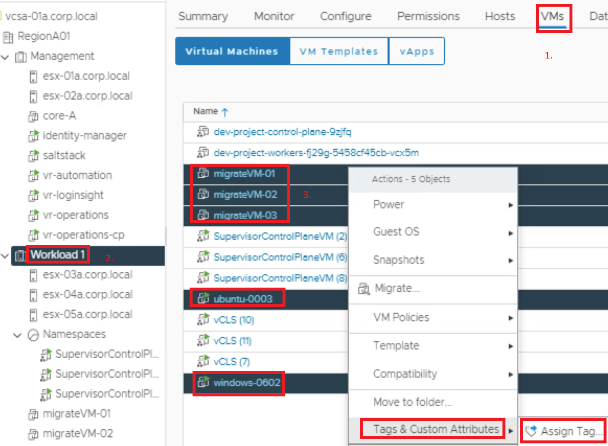
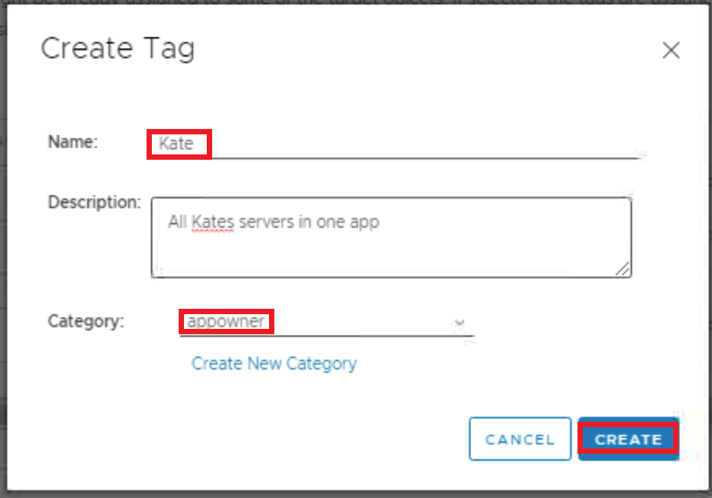
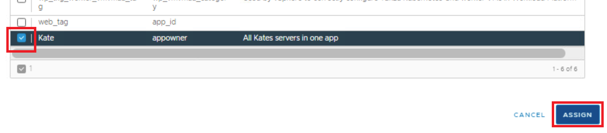
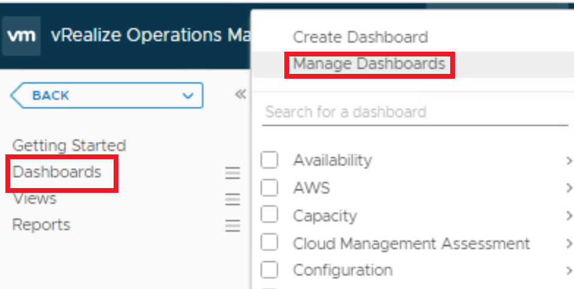
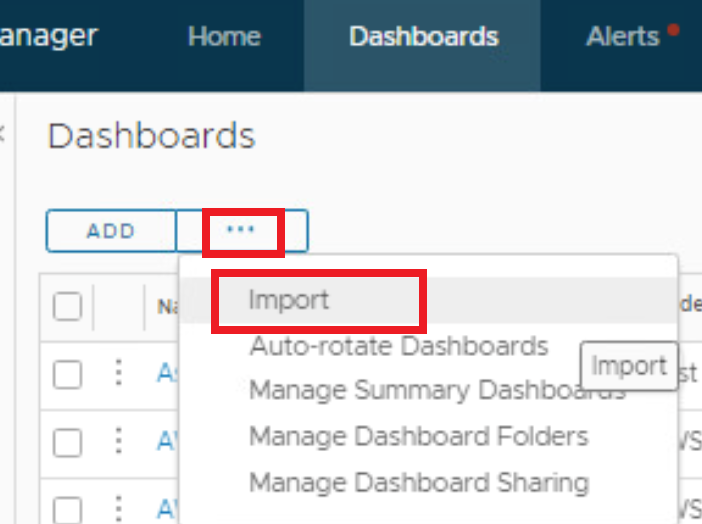
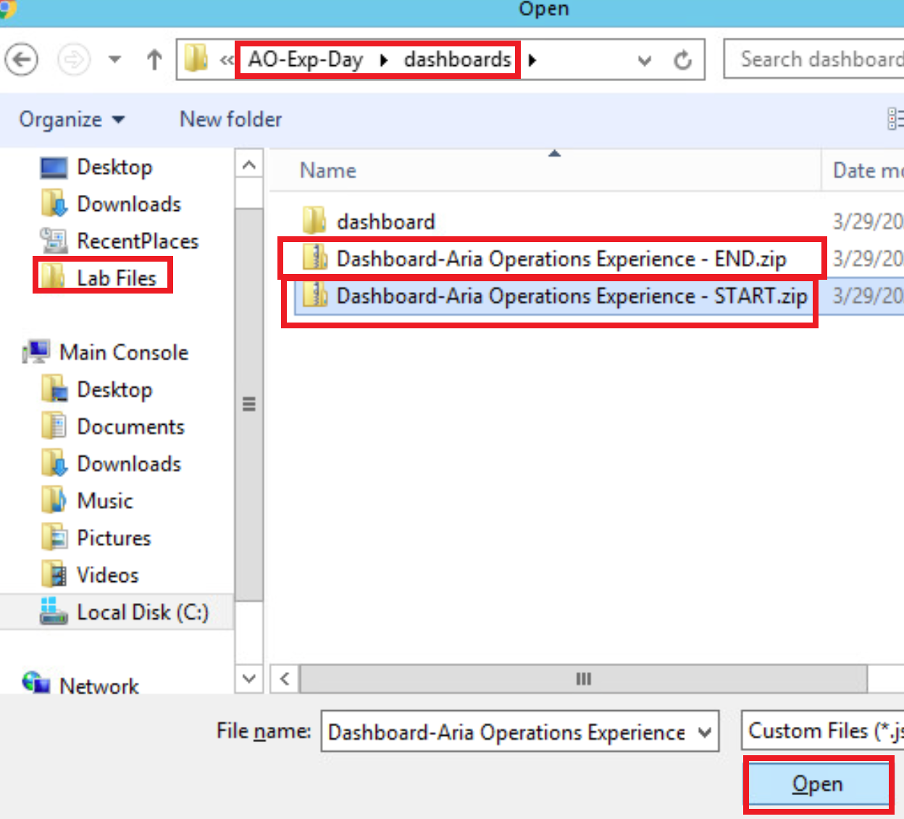

# Making your Workspace workable

- Click on **Extend** a couple of times to extend the time the Lab stays alive. 
- Close the Lab Manual by clicking **the X:**
  - Maximize the Lab window by clicking the **Maximize Icon**
    

## vSphere requisites

We need to tag some VM’s that we will use in our Lab to get some members of a Custom group, and use that group in dashboards and views:

- In vSphere, Click **the workload domain**, 
- click **VMs**
- **select** the 5 VMs as shown
- RightClick and Choose **Assign Tag** from the Tags & Custom Attributes
  

- Click **Yes** to confirm this action on 5 objects
- Click the Blue **Add Tag**
- Click **Create New Category**
- ​    Category Name: **appowner**
- ​    Click **Many Tags**
- ​    Click **Create**
- Under the Create Tag, use Name: **Kate**, and Category: **appowner**, then Click **Create**
  

Under the “5 objetcs - Assign Tag” window, Select the appropriate tag and click **Assign**

Congratulations, we’re done with the vSphere portion  :-)

# Looking for Lab files

On the desktop, double-click **Lab Files** and browse to the location shown here. Just note the location of the folder and files, as they will be used in the import section below. 

- The first being the custom_groups

# Import into Aria Operations

## Import a custom group

- Click **Environment**
- Click **Custom Groups**
- on the three dotted menu select **Import**
  

- Click **BROWSE…**
- Browse to the folder called **custom_groups**
- select the **Ops Exp Day - CustomGroup.json** file
- Click **Import** 
- after the import, click **Done**
  

## Importing a view

Goto Dashboards>Views and select **Manage Views**

- In the views, on the dotted menu, choose **Import**

  

- Click Browse an go to the **views** subfolder 

- **select** the Zip file

- Click **Open**

  

  After you have imported Click **DONE**

## Importing a dashboard

- Click **Dashboards**

- Select **Manage Dashboards**
  

- On the dotted menu, click **Import**
  

- We need to import <u>BOTH</u> these dashboards
- We will need to; Browse + Open **Twice**: 
  

- Repeat for the other dashboard

Now You’re done and ready for some real work  :-) 