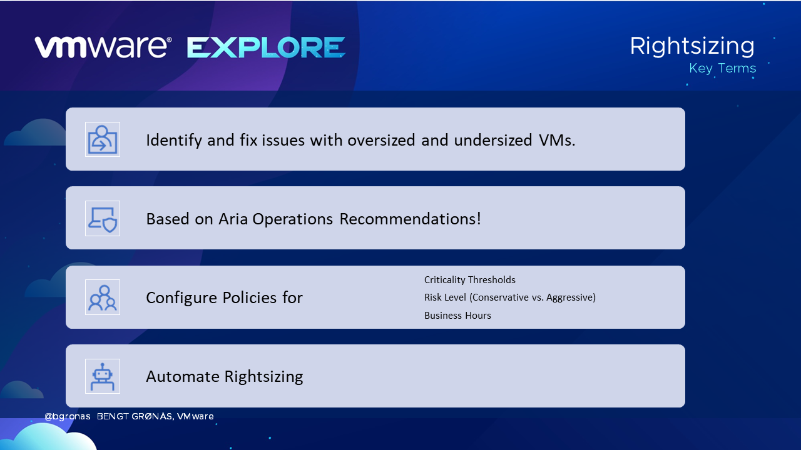
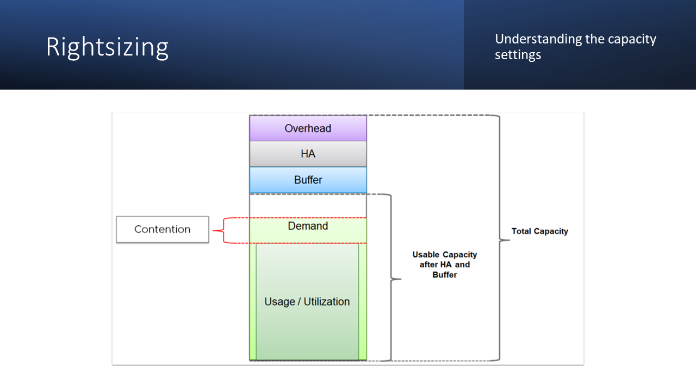
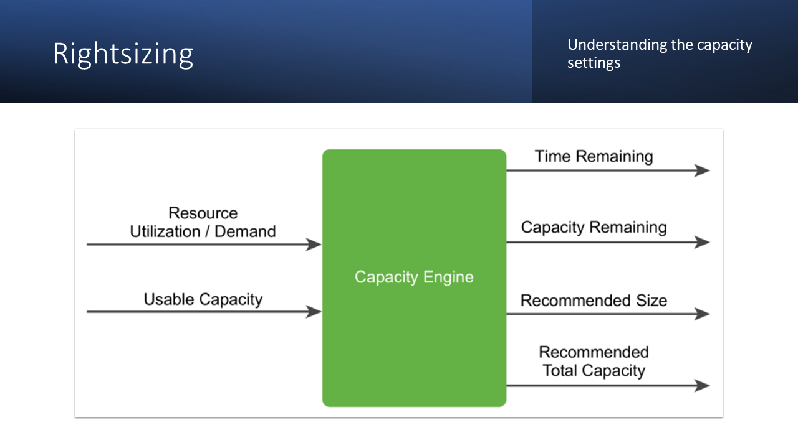
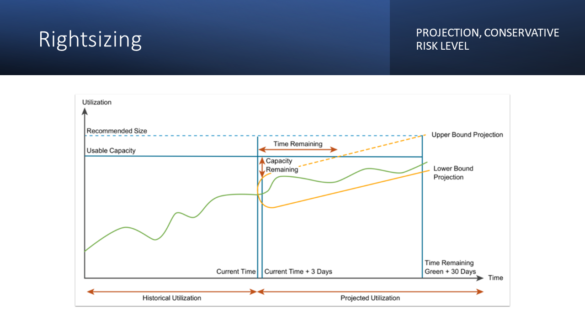
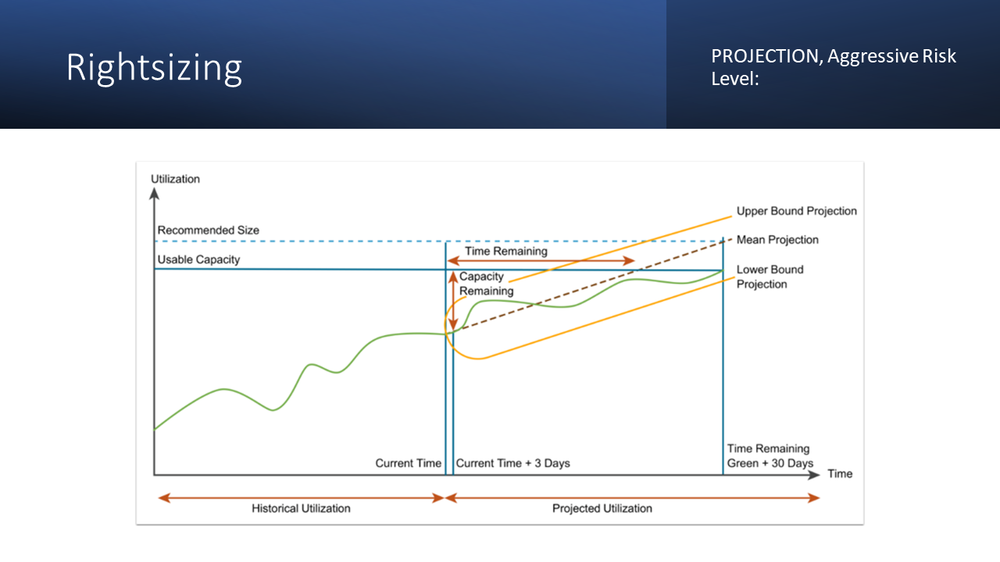
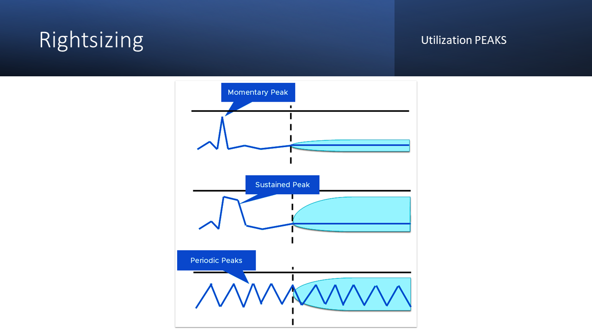

# Rightsizing 

What is Rightsizing?  It should be pretty obvious? 

- It's a proactive practice, not a one-time work!
- Maximizes performance efficiency
- Reduces costs
- Ensures seamless alignment with requirements

### Definitions
- **Total Capacity:** All available resources (CPU, memory, disk space, IOPS) in the environment.
- **Usage:** Resources presently utilized by VMs and system services.
- **Demand:** Resources needed by VMs; equals usage unless a resource is constrained.
- **Usable Capacity:** Total capacity minus a buffer set aside for workload spikes.
- **Usable Capacity after HA and Buffer:** Usable capacity less resources reserved for HA failover.

The capacity engine analyzes historical utilization and projects future workload using real-time predictive capacity analytics. 

##### INPUT:  

- Demand 
- Usable Capacity metrics

##### GENERATED OUTPUT: 

- Time Remaining (estimated time before full utilization)
- Capacity Remaining (available capacity)
- Recommended Size (optimal resource configuration)
- Recommended Total Capacity (required future capacity)

##### Recommended size

Determined by projecting utilization for a specific period. The recommended size does not include HA settings. To maintain conservative recommendations, VMware Aria Operations imposes caps on the recommended size generated by the capacity engine.

*) **Oversized:** Aria Operations limits oversized recommendations to 50% of the current allocation. For instance, if a virtual machine with 8 vCPUs #historically only used up to 10% CPU, the recommendation is capped at reclaiming 4 vCPUs rather than 7.

*) **Undersized:** Aria Operations limits undersized recommendations to 100% of the current allocation. For example, if a virtual machine with 4 vCPUs consistently experiences high resource utilization, the recommendation is capped at adding 4 vCPUs instead of suggesting 8.

##### Capacity calculations for a Conservative Risk Level

- Customize the level of conservatism

- Prioritize stability
- Ensure enough resources for future growth and demand.
- A cautious approach to capacity planning
- Lower consolidation ratios + higher resource overhead

##### Capacity calculations for a Aggressive Risk Level

- Aim to maximize resource utilization and minimize overhead.
- Assumes a higher tolerance for risk 
- Allows for more aggressive allocation of resources.
- Result: Higher consolidation ratios + tighter resource utilization.

##### Utilization peaks
- Momentary Peaks: Short-lived peaks that are a one-time occurrence. Not significant enough to require additional capacity.
- Sustained Peaks: Last for a longer time and impact projections. 
- Periodic Peaks: Cyclical patterns or waves. (hourly, daily, weekly, monthly, last day of the month, etc)

Learn more about [Aria products using the Customer Journey.](https://apps-cloudmgmt.techzone.vmware.com/vmware-aria-cloud-management) 
