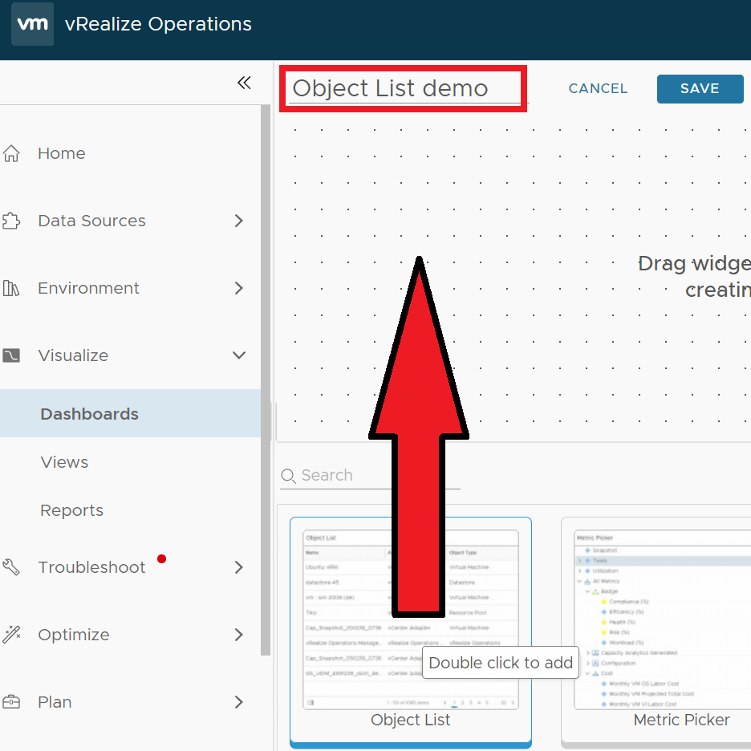
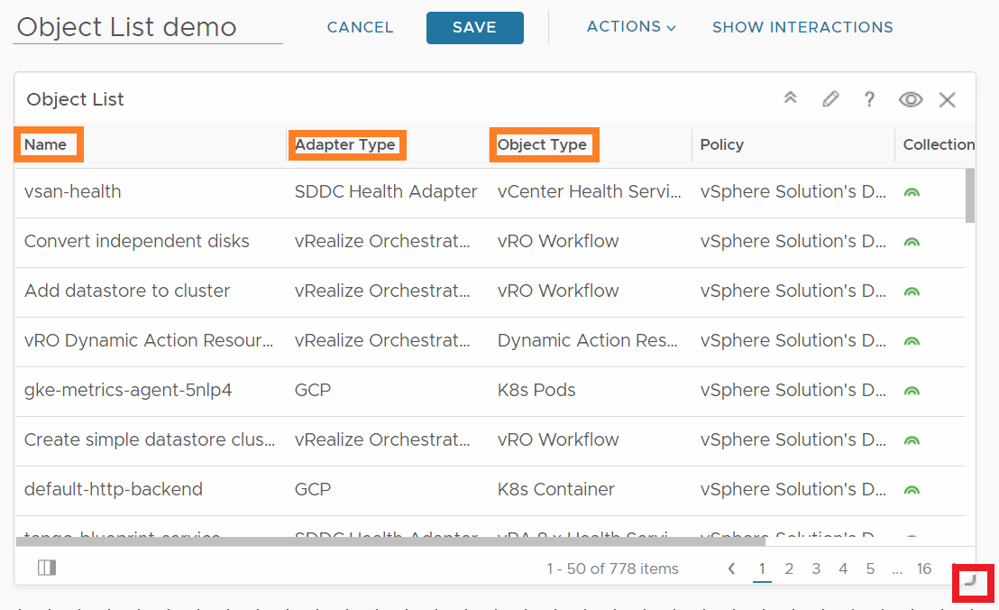
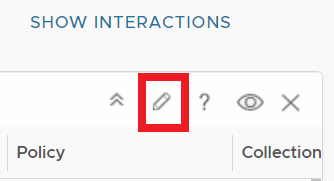
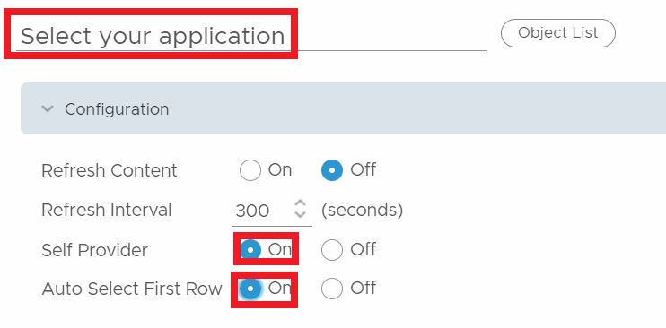
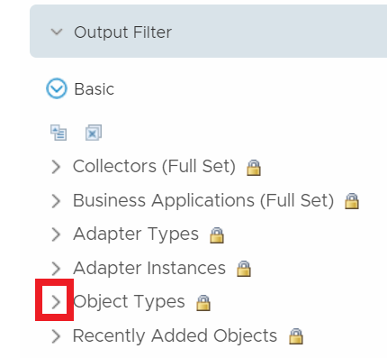
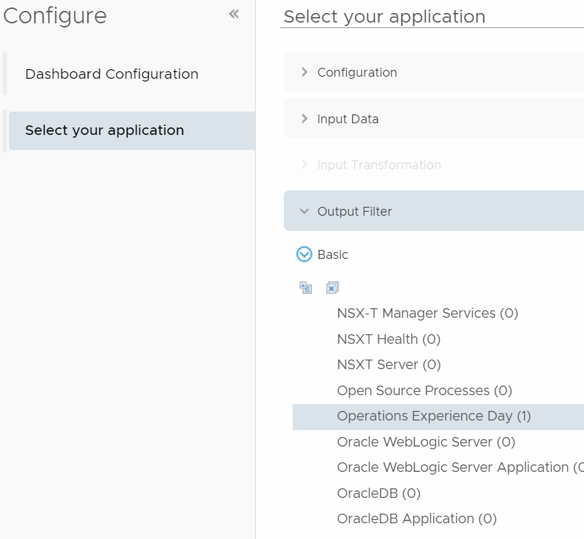
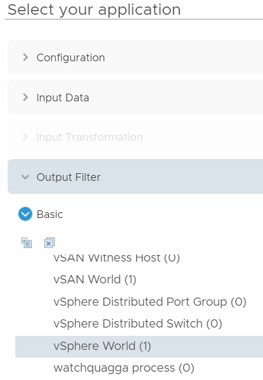
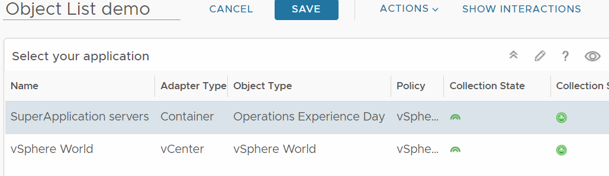

# Create a selection widget 

Many times when we create dashboards, they contain a list where you can select something from. Based on you selection list, all the other widgets on that dashboard will follow your selection. Your selection list can be a Object list widget or even a view!   But, before we get too advanced let’s create one. 

The pre requisite is that you already have created a Custom group containing interesting servers you would like to have more information about. If you don’t know how to create one, >>>GO HERE>>>

#### Create a an object list

1. In vrops 8.10.2: Visualize>Dashboards>**Manage**, 
   in previous vrops 8.4: on the top>Dashboard>Dashboards>**Manage Dashboards**

2. Click **Add**

3. **Name** your dashboard something more clever than “New Dashboard”

4. At the bottom pane, in the list of widgets, **drag and drop the object list widget** onto our newly created dashboard
   

   Your object list has a lot of items on it, and this is something we need to limit to make it a more sensible as a selection list. Now, the list contains all objects types, all adapter types and all object names from we’ve discovered in vSphere, that makes less sense! We need to limit the choices we see in this list. Resize your widget a tad, by drag’n’drop in the lower left corner

   

5. On top-right on the widget, Click on the **Pencil** to edit the widget

   

6. **Rename** your Object list to “Select your application”

   

7. Leave the input data to the default: **All**, go to **>Output Filter**, and in Output filter, expand **Object Types**
   

8. Scroll down the list and try to find your previously created Custom Group, **Group Type**. In this example the name will be “Operations Experience day”
   

9. Now that we got that sorted, let us select another, Scroll down and click to select **vSphere World** 

   

10. So now that we got Two selections, both our own Group Type and vSphere world it is time to click **SAVE**

    Happy days. We now got a MUCH more sensible selection list that let’s us select all our applications, that are custom groups residing underneath the umbrella (Group Type) called “Operations Experience day”. I’d choose your company name or another group type name of course! you could choose to create a Group Type like this:  <company abbreviation>-<department>-<apps>, eg.  MSFT-DEV-APPS, or VMW-PROD-APPS. Be creative, but keep you grouping header smart for your company. Create just one, or a few in the beginning! 

11. The end results should look something like this:

    

#### Conclusion

We have now got a selection list that creates a basis for many other dashboard widgets

